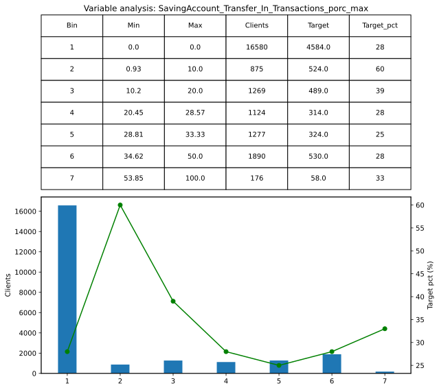
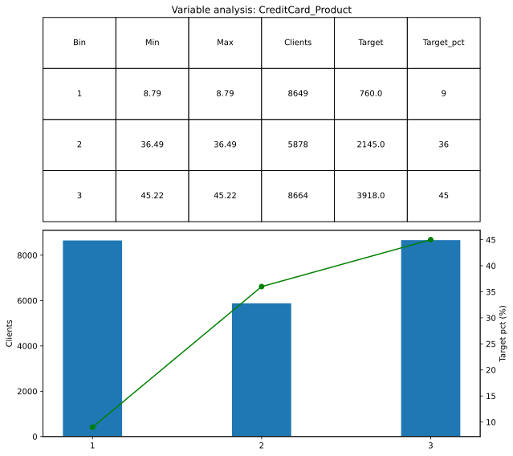
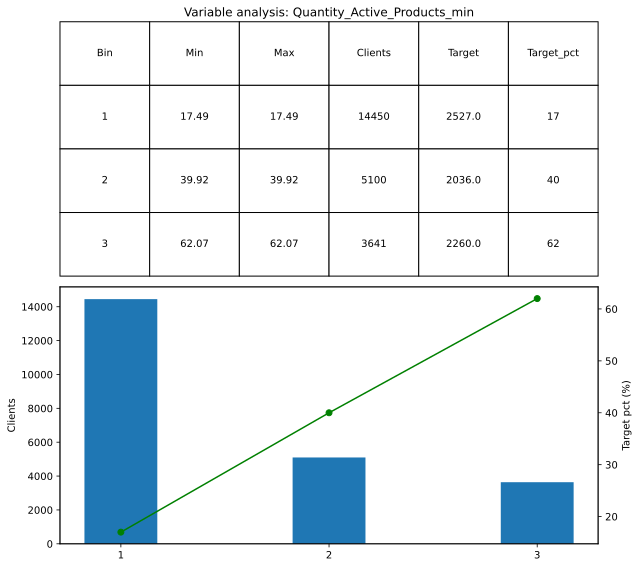
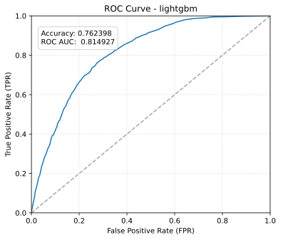
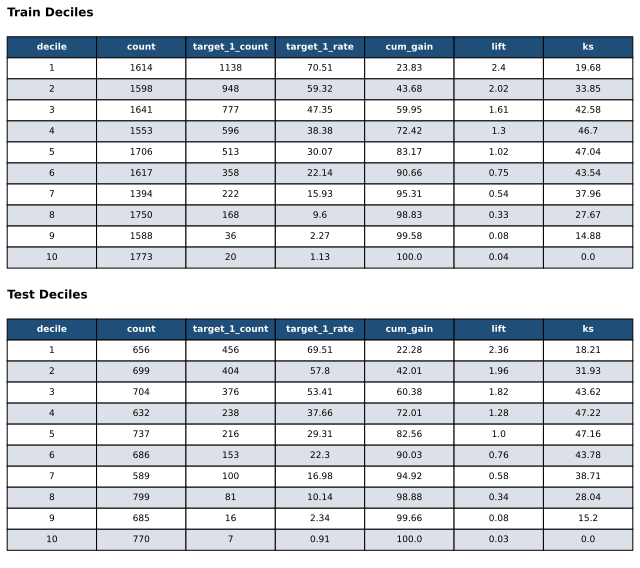

---
jupyter:
  jupytext:
    formats: ipynb,md
    text_representation:
      extension: .md
      format_name: markdown
      format_version: '1.3'
      jupytext_version: 1.19.5
  kernelspec:
    display_name: .venv
    language: python
    name: python3
---

# Setup inicial e imports

```python
from bank_clients_ml.notebook_config import setup_notebook

setup_notebook()
```

```python
import polars as pl

from bank_clients_ml.config import get_settings
from bank_clients_ml.features import (
    CorrelationAnalyzer,
    compute_percentage,
    get_constant_columns,
    get_date_windows,
    get_imbalanced_binary_columns,
    group_bins_by_ranges,
    group_columns_by_source,
    target_encode_columns,
)
from bank_clients_ml.graphs import (
    generate_bivariate_charts,
    plot_deciles,
    plot_evaluation_metrics,
    plot_top_features,
)
from bank_clients_ml.models import (
    compute_prediction_deciles,
    get_feature_importances,
    get_scoring,
    stratified_train_test_split,
)
from bank_clients_ml.transformations import (
    add_extra_transformations,
    add_transformations,
)
from bank_clients_ml.utils import (
    columns_with_zeros,
    count_row_matches,
    filter_columns_by_cardinality,
    filter_nonzero,
    inspect_dataframe,
    low_cardinality_value_counts,
    mins_in_range,
    print_without_trunc,
)

settings = get_settings()
```

# EDA (Exploratory Data Analysis)

```python
data = pl.read_parquet("../data/data.parquet")
print(data.shape)
data.describe()
```

```python
less_than_zero_columns = [
    "SavingAccount_Balance_Average",
    "CreditCard_Balance_ARG",
    "CreditCard_Balance_DOLLAR",
    "CreditCard_Total_Spending",
    "CreditCard_Spending_1_Installment",
    "CreditCard_Spending_Aut_Debits",
    "CreditCard_Revolving",
]

greater_than_thirty_one_columns = [
    "SavingAccount_Days_with_use",
    "SavingAccount_Days_with_Debits",
]

print(
    count_row_matches(data, columns=less_than_zero_columns, threshold=0, condition="<")
)
print(
    count_row_matches(
        data, columns=greater_than_thirty_one_columns, threshold=31, condition=">"
    )
)
```

```python
print_without_trunc(low_cardinality_value_counts(data))
```

```python
print_without_trunc(filter_columns_by_cardinality(data, condition=">", threshold=10))
```

```python
print_without_trunc(inspect_dataframe(data))
```

```python
print_without_trunc(data.null_count())
print_without_trunc(data.filter(pl.col(settings.col_target).is_null()))
print(data.filter(pl.col(settings.col_target).is_null()).select(settings.col_id))
```

## Limpieza inicial

```python
print(data.shape)
clean_data = data.filter(pl.col(settings.col_target).is_not_null())
print_without_trunc(inspect_dataframe(clean_data))
clean_data = clean_data.with_columns(
    pl.col("Month", "First_product_dt", "Last_product_dt").str.to_date(),
    pl.col(settings.col_id).cast(pl.Int64),
)
```

## Obtener meses relevantes

```python
training_months, prediction_months = get_date_windows(
    clean_data, "Month", prediction_window_size=2
)

last_training_month = training_months[-1]
first_prediction_month = prediction_months[0]

print("training_months:", training_months)
print("prediction_months:", prediction_months)
print("last_training_month:", last_training_month)
print("first_prediction_month:", first_prediction_month)
```

## Definir Universo y Target

```python
month_count_by_client = clean_data.group_by(settings.col_id).len(name="month_count")
print(month_count_by_client["month_count"].value_counts())
```

Mantengo en el universo los clientes que:
- tienen 9 meses de historia
- no tienen 'Package_Active' y 'CreditCard_CoBranding' en el ultimo mes de la ventana de entrenamiento

y para cada cliente del universo mantengo la columna de target de la ventana de prediccion

```python
is_valid_client = (
    (pl.col("Month") == last_training_month)
    & (pl.col("Package_Active") == "No")
    & (pl.col("CreditCard_CoBranding") == "No")
)

universe_and_target = (
    clean_data.filter(
        (pl.len().over(settings.col_id) == 9)
        & is_valid_client.any().over(settings.col_id)
        & pl.col("Month").is_in(prediction_months)
    )
    .select(settings.col_id, settings.col_target)
    .unique()
)

clean_data = clean_data.drop(settings.col_target).join(
    universe_and_target, on=settings.col_id, how="inner"
)

training_data = clean_data.filter(pl.col("Month").is_in(training_months))
prediction_data = clean_data.filter(pl.col("Month").is_in(prediction_months))

print(f"universe_and_target.shape: {universe_and_target.shape} \n")
print(f"prediction_data.shape: {prediction_data.shape} \n")
print(f"training_data['Month'].value_counts(): {training_data['Month'].value_counts()}")
```

```python
inspect_dataframe(training_data)
```

# Feature Engineering
## Valores Nulos

```python
null_cols = ["SavingAccount_Balance_Average", "Region", "CreditCard_Product"]
print(f"{training_data.select(null_cols).describe()} \n")
print(
    f"SavingAccount_Balance_Average unique values: "
    f"{training_data.select('SavingAccount_Balance_Average').n_unique()} \n"
)
```

### Completando 'SavingAccount_Balance_Average'
Primero se analizan registros con nulos en SavingAccount_Balance_Average y valores monetarios de SavingAccount sin nulos:

```python
saving_account_cols = [
    "SavingAccount_Balance_Average",
    "SavingAccount_Balance_FirstDate",
    "SavingAccount_Balance_LastDate",
    "SavingAccount_Total_Amount",
    "SavingAccount_Salary_Payment_Amount",
    "SavingAccount_Transfer_In_Amount",
    "SavingAccount_Credits_Amounts",
    "SavingAccount_ATM_Extraction_Amount",
    "SavingAccount_Service_Payment_Amount",
    "SavingAccount_CreditCard_Payment_Amount",
    "SavingAccount_Transfer_Out_Amount",
    "SavingAccount_DebitCard_Spend_Amount",
    "SavingAccount_Debits_Amounts",
]

training_data.select([settings.col_id, *saving_account_cols]).filter(
    pl.col("SavingAccount_Balance_Average").is_null()
)
```

```python
filter_nonzero(training_data, saving_account_cols)
```

Luego saco el promedio entre "SavingAccount_Balance_FirstDate" y "SavingAccount_Balance_LastDate".
Este no es el calculo correcto para "SavingAccount_Balance_Average", pero no va a afectar tanto al modelo porque son solo 4 registros con nulos ademas de que no hay una forma sencilla de calcular el "SavingAccount_Balance_Average" con los datos que tenemos

```python
training_data = training_data.with_columns(
    pl.col("SavingAccount_Balance_Average").fill_null(
        (
            pl.col("SavingAccount_Balance_FirstDate")
            + pl.col("SavingAccount_Balance_LastDate")
        )
        / 2.0
    )
)

print(f"{training_data.select('SavingAccount_Balance_Average').describe()} \n")
inspect_dataframe(training_data)
```

### Completando 'Region'
Traigo las regiones de  los clientes desde la ventana de prediccion y pongo la Region mas comun para llenar los nulos restantes

```python
clients_region = prediction_data.select(settings.col_id, "Region").unique()

training_data = training_data.drop("Region").join(
    clients_region.with_columns(pl.col("Region").fill_null("BUENOS AIRES")),
    on=settings.col_id,
    how="left",
)

print(f"{clean_data.select('Region').describe()} \n")
print(f"{clients_region.describe()} \n")
print(f"{clients_region.shape} \n")
print(f"{clients_region['Region'].value_counts(sort=True)} \n")
print(f"{training_data['Region'].value_counts(sort=True)} \n")
print(f"{training_data.select('Region').describe()} \n")
training_data.shape
```

### Completando 'CreditCard_Product'

Traigo los CreditCard_Product de la ventana de prediccion. 

Hay algunos clientes que tienen un CreditCard_Product en el primer mes de prediccion y otro CreditCard_Product en el segundo mes de prediccion

Por lo tanto se obtiene el valor del primer mes de la ventana de prediccion y, si este es null o no existe, toma el valor del segundo mes como fallback, incluso si también es null

Luego para llenar los nulos restantes, pongo la CreditCard_Product mas comun cuando el cliente no tiene `CreditCard_Active` en la ventana de prediccion pero si tiene `CreditCard_Active` en la ventana de entrenamiento. en los demas casos lleno los nulls con "0" (cuando no tiene `CreditCard_Active` en la ventana de prediccion ni en la ventana de entrenamiento o cuando no tiene `CreditCard_Active` en la ventana de entrenamiento, por mas que lo tenga en la ventana de prediccion)

```python
clients_creditcard_product = (
    prediction_data.sort(pl.col("Month") == first_prediction_month, descending=True)
    .group_by(settings.col_id)
    .agg(pl.col("CreditCard_Product").drop_nulls().first())
)

training_data = (
    training_data.drop("CreditCard_Product")
    .join(
        clients_creditcard_product,
        on=settings.col_id,
        how="left",
    )
    .with_columns(
        pl.when(
            pl.col("CreditCard_Product").is_null()
            & (pl.col("CreditCard_Active") == "Yes")
        )
        .then(pl.col("CreditCard_Product").fill_null("J55660104XX012"))
        .otherwise(pl.col("CreditCard_Product").fill_null("0"))
        .alias("CreditCard_Product")
    )
)

print(f"{clean_data.select('CreditCard_Product').describe()} \n")
print(f"{clients_creditcard_product.describe()} \n")
print(f"{clients_creditcard_product['CreditCard_Product'].value_counts(sort=True)} \n")
print(f"{training_data['CreditCard_Product'].value_counts(sort=True)} \n")
print(f"{training_data.select('CreditCard_Product').describe()} \n")
```

```python
inspect_dataframe(training_data)
```

## Identity Features

```python
binary_dict: dict[str, int] = {"Yes": 1, "No": 0, "M": 1, "F": 0}

binary_identity_features_columns = [
    "CreditCard_Premium",
    "CreditCard_Active",
    "CreditCard_CoBranding",
    "Loan_Active",
    "Mortgage_Active",
    "SavingAccount_Active_ARG_Salary",
    "SavingAccount_Active_ARG",
    "SavingAccount_Active_DOLLAR",
    "DebitCard_Active",
    "Investment_Active",
    "Package_Active",
    "Insurance_Life",
    "Insurance_Home",
    "Insurance_Accidents",
    "Insurance_Mobile",
    "Insurance_ATM",
    "Insurance_Unemployment",
    "Sex",
    "Mobile",
    "Email",
]

categorical_cols = ["Client_Age_grp", "Region", "CreditCard_Product"]

identity_features_columns = [
    settings.col_id,
    settings.col_target,
    *categorical_cols,
    "First_product_dt",
    "Last_product_dt",
    *binary_identity_features_columns,
]

training_data = training_data.with_columns(
    pl.col(binary_identity_features_columns).replace_strict(binary_dict).cast(pl.UInt8)
)

identity_features = training_data.filter(pl.col("Month") == last_training_month).select(
    identity_features_columns
)

print_without_trunc(
    low_cardinality_value_counts(identity_features.drop(categorical_cols))
)
```

```python
print_without_trunc(inspect_dataframe(identity_features))
identity_features.describe()
```

## Variables Categoricas

```python
print_without_trunc(
    low_cardinality_value_counts(identity_features.select(categorical_cols))
)

identity_features = target_encode_columns(identity_features, categorical_cols)

print_without_trunc(
    low_cardinality_value_counts(identity_features.select(categorical_cols))
)
```

```python
print(f"training_data: {training_data.shape}")
training_data = training_data.drop(categorical_cols)
print_without_trunc(inspect_dataframe(training_data))
```

## Fechas

```python
identity_features = identity_features.with_columns(
    [
        (pl.col("Last_product_dt") - pl.col("First_product_dt"))
        .dt.total_days()
        .alias("Days_between_first_and_last_product"),
        (pl.lit(last_training_month).dt.offset_by("1mo") - pl.col("Last_product_dt"))
        .dt.total_days()
        .alias("Recency_in_days"),
    ]
).drop(["First_product_dt", "Last_product_dt"])

print_without_trunc(inspect_dataframe(identity_features))
identity_features.describe()
```

## Transform features
### Analizando valores minimos y ceros

```python
print(mins_in_range(training_data, -1, 1))
print_without_trunc(columns_with_zeros(training_data))
```

### Analizando valores monetarios de CreditCard

```python
credit_card_cols = [
    "CreditCard_Balance_ARG",
    "CreditCard_Balance_DOLLAR",
    "CreditCard_Total_Limit",
    "CreditCard_Total_Spending",
    "CreditCard_Spending_1_Installment",
    "CreditCard_Spending_Installments",
    "CreditCard_Spending_CrossBoarder",
    "CreditCard_Spending_Aut_Debits",
    "CreditCard_Revolving",
]

filter_nonzero(training_data, credit_card_cols)
```

### Generando transformaciones

```python
print(training_data.shape)
training_data = add_transformations(training_data)

print_without_trunc(inspect_dataframe(training_data))
training_data.describe()
```

```python
training_data.select(
    [
        settings.col_id,
        "SavingAccount_Transactions_Transactions",
        "Operations_total",
        "CreditCard_Payment_total",
    ]
).filter(
    (pl.col("SavingAccount_Transactions_Transactions") != 0)
    & (pl.col("Operations_total") != 0)
    & (pl.col("CreditCard_Payment_total") != 0)
)
```

```python
greater_than_one_hundred_columns = [
    "SavingAccount_Transfer_In_Amount_porc",
    "SavingAccount_Transfer_In_Amount_CR_porc",
    "SavingAccount_Balance_last_minus_first_date_porc",
]

count_row_matches(
    training_data,
    columns=greater_than_one_hundred_columns,
    threshold=100,
    condition=">",
)
```

## Aggregate Features

Antes de la agregacion se ordenan los registros de cada cliente por mes para que luego funcionen "first" y "last" correctamente

diff_rel (Diferencia relativa): (último / primero)

pct_var (Variación porcentual): 1 - diferencia relativa

```python
columns_with_monetary_values = [
    "SavingAccount_Balance_FirstDate",
    "SavingAccount_Balance_LastDate",
    "SavingAccount_Balance_Average",
    "SavingAccount_Salary_Payment_Amount",
    "SavingAccount_Transfer_In_Amount",
    "SavingAccount_ATM_Extraction_Amount",
    "SavingAccount_Service_Payment_Amount",
    "SavingAccount_CreditCard_Payment_Amount",
    "SavingAccount_Transfer_Out_Amount",
    "SavingAccount_DebitCard_Spend_Amount",
    "SavingAccount_Total_Amount",
    "SavingAccount_Credits_Amounts",
    "SavingAccount_Debits_Amounts",
    "SavingAccount_Balance_last_minus_first_date",
    "CreditCard_Balance_ARG",
    "CreditCard_Balance_DOLLAR",
    "CreditCard_Total_Spending",
    "CreditCard_Spending_1_Installment",
    "CreditCard_Spending_Installments",
    "CreditCard_Spending_CrossBoarder",
    "CreditCard_Spending_Aut_Debits",
    "CreditCard_Revolving",
]

columns_with_quantities = [
    c
    for c in training_data.columns
    if c
    not in {
        *columns_with_monetary_values,
        *identity_features.columns,
        "Month",
        "First_product_dt",
        "Last_product_dt",
        settings.col_id,
        settings.col_target,
    }
]

cols = pl.col([*columns_with_quantities, *columns_with_monetary_values])

agg_exprs = [
    cols.min().name.suffix("_min"),
    cols.max().name.suffix("_max"),
    cols.mean().name.suffix("_mean"),
    cols.median().name.suffix("_median"),
    cols.sum().name.suffix("_sum"),
    (cols != 0).sum().name.suffix("_count_nonzero"),
    cols.var().name.suffix("_var"),
    cols.std().name.suffix("_std"),
    pl.col(columns_with_quantities).n_unique().name.suffix("_nunique"),
    (pl.col(columns_with_monetary_values) / 1000.0)
    .round()
    .n_unique()
    .name.suffix("_rounded_nunique"),
    (cols.max() - cols.min()).name.suffix("_ptp"),
    (cols.last() - cols.first()).name.suffix("_diff"),
    compute_percentage(cols.last(), cols.first()).name.suffix("_diff_rel"),
    (compute_percentage(cols.last(), cols.first()) - 100.0).name.suffix("_pct_var"),
]

data_agg = (
    training_data.sort([settings.col_id, "Month"])
    .group_by(settings.col_id)
    .agg(agg_exprs)
)

inspect_dataframe(data_agg)
```

# ABT

```python
ABT = identity_features.join(data_agg, on=settings.col_id, how="inner")
inspect_dataframe(ABT)
```

## Agrego transformadas extras luego de las operaciones de agregacion

```python
ABT = add_extra_transformations(ABT)
print_without_trunc(mins_in_range(ABT, -1, 1))
inspect_dataframe(ABT)
```

```python
train, test = stratified_train_test_split(ABT)
print(train.shape)
train.describe()
```

## Reduccion de dimensionalidad
### Elimino columnas con valores unicos

```python
constant_cols = get_constant_columns(train)
reduced_train = train.drop(constant_cols)
reduced_test = test.drop(constant_cols)

print(f"reduced_train sin columnas con valores unicos: {reduced_train.shape} \n")
constant_cols
```

### Elimino columnas binarias con baja representatividad

```python
imbalanced_binary_columns = get_imbalanced_binary_columns(reduced_train)

print_without_trunc(
    low_cardinality_value_counts(reduced_train.select(imbalanced_binary_columns))
)

reduced_train = reduced_train.drop(imbalanced_binary_columns)
reduced_test = reduced_test.drop(imbalanced_binary_columns)
print("train sin columnas binarias poco representativas:", reduced_train.shape)
```

### Elimino columnas correlacionadas entre si

```python
correlated_train = reduced_train.clone()
correlated_test = reduced_test.clone()
correlation_analyzer = CorrelationAnalyzer(correlated_train)

to_delete = correlation_analyzer.get_redundant_correlated_columns(threshold=0.80)
uncorrelated_train = correlated_train.drop(to_delete)
uncorrelated_test = correlated_test.drop(to_delete)

print(f"cantidad de columnas con correlacion mayor a 80%: {len(to_delete)}")
print("train sin columnas con correlacion mayor a 80%:", uncorrelated_train.shape)
```

# Feature Selection

## Ordeno las variables por fuente segun importancia usando lightGBM para quedarme con las mas importantes

No estandarizo el dataframe por que lightGBM no lo necesita

- primero entreno con todas las variables, para tener roc de referencia:
- luego entreno con cada grupo por separado
- luego entreno con los mejores de cada grupo al mismo tiempo

```python
all_cols = [
    col
    for col in uncorrelated_train.columns
    if col not in {settings.col_id, settings.col_target}
]

columns_by_source = group_columns_by_source(all_cols)

print(
    f"cols_saving_account_days_transactions: "
    f"{len(columns_by_source['saving_account_days_transactions'])} \n"
    f"cols_saving_account_monetary: {len(columns_by_source['saving_account_monetary'])} \n"
    f"cols_operations: {len(columns_by_source['operations'])} \n"
    f"cols_credit_card_payment: {len(columns_by_source['credit_card_payment'])} \n"
    f"cols_credit_card_monetary: {len(columns_by_source['credit_card_monetary'])} \n"
    f"cols_others: {len(columns_by_source['others'])}"
)
columns_by_source["others"]
```

```python
all_cols_searcher, all_cols_importances = get_feature_importances(
    uncorrelated_train, all_cols
)
all_cols_searcher
```

```python
(
    cols_saving_account_days_transactions_searcher,
    cols_saving_account_days_transactions_importances,
) = get_feature_importances(
    uncorrelated_train, columns_by_source["saving_account_days_transactions"]
)
cols_saving_account_days_transactions_searcher
```

```python
cols_saving_account_monetary_searcher, cols_saving_account_monetary_importances = (
    get_feature_importances(
        uncorrelated_train, columns_by_source["saving_account_monetary"]
    )
)
cols_saving_account_monetary_searcher
```

```python
cols_operations_searcher, cols_operations_importances = get_feature_importances(
    uncorrelated_train, columns_by_source["operations"]
)
cols_operations_searcher
```

```python
cols_credit_card_payment_searcher, cols_credit_card_payment_importances = (
    get_feature_importances(
        uncorrelated_train, columns_by_source["credit_card_payment"]
    )
)

cols_credit_card_payment_searcher
```

```python
cols_credit_card_monetary_searcher, cols_credit_card_monetary_importances = (
    get_feature_importances(
        uncorrelated_train, columns_by_source["credit_card_monetary"]
    )
)

cols_credit_card_monetary_searcher
```

```python
cols_others_searcher, cols_others_importances = get_feature_importances(
    uncorrelated_train, columns_by_source["others"]
)
cols_others_searcher
```

```python
plot_top_features(all_cols_importances, "all_cols_importances", all_cols_searcher)
plot_top_features(
    cols_saving_account_days_transactions_importances,
    "cols_saving_account_days_transactions_importances",
    cols_saving_account_days_transactions_searcher,
)
plot_top_features(
    cols_saving_account_monetary_importances,
    "cols_saving_account_monetary_importances",
    cols_saving_account_monetary_searcher,
    30,
)
plot_top_features(
    cols_operations_importances, "cols_operations_importances", cols_operations_searcher
)
plot_top_features(
    cols_credit_card_payment_importances,
    "cols_credit_card_payment_importances",
    cols_credit_card_payment_searcher,
)
plot_top_features(
    cols_credit_card_monetary_importances,
    "cols_credit_card_monetary_importances",
    cols_credit_card_monetary_searcher,
)
plot_top_features(
    cols_others_importances, "cols_others_importances", cols_others_searcher
)
```


```python
most_important_features = [
    *cols_saving_account_days_transactions_importances.head(1)
    .get_column("Feature")
    .to_list(),
    *cols_saving_account_monetary_importances.head(1).get_column("Feature").to_list(),
    *cols_operations_importances.head(1).get_column("Feature").to_list(),
    *cols_credit_card_payment_importances.head(1).get_column("Feature").to_list(),
    *cols_credit_card_monetary_importances.head(2).get_column("Feature").to_list(),
    *cols_others_importances.head(3).get_column("Feature").to_list(),
]

most_important_features_searcher, most_important_features_importances = (
    get_feature_importances(uncorrelated_train, most_important_features)
)
plot_top_features(
    most_important_features_importances,
    "most_important_features",
    most_important_features_searcher,
)
most_important_features_searcher
```


## Analisis Bivariado

```python
tables_analysis = generate_bivariate_charts(
    uncorrelated_train, most_important_features, "analysis"
)
```





### Buscando variables correlacionadas eliminadas anteriormente
Para poder intercambiar las variables mas importantes por variables mas faciles de interpretar, si es que existen.

```python
most_important_features_2 = (
    most_important_features_importances.head(5).get_column("Feature").to_list()
)

for x in most_important_features_2:
    print(f"\n Columnas correlacionadas con {x}:")
    print_without_trunc(correlation_analyzer.get_correlations_for(x))
```

```python
most_important_features_correlated = [
    "Operations_total_mean",
    "Operations_total_median",
    "CreditCard_Active",
    "CreditCard_Balance_ARG_SP_porc_mean",
    "Quantity_Active_Products_median",
    "Quantity_Active_Products_mean",
]

tables_analysis_2 = generate_bivariate_charts(
    correlated_train, most_important_features_correlated, "analysis_2"
)
```


### Transformando mejores variables segun analisis bivariado y LightGBM

Transformo variables agregandoles el porcentaje de target y agrupo los valores.
A las variables categoricas solo las agrupo (ya las transforme anteriormente)

variables a modificar:
- Client_Age_grp
    - agrupo "Entre 50 y 59 años" + "Entre 60 y 64 años" + "Entre 65 y 69 años" (final: "Entre 50 y 69 años")
    - default -> junto totas las demas edades ("Entre 18 y 29 años" + "Entre 30 y 39 años" + "Entre 40 y 49 años" + "Mayor a 70 años")
- Operations_total_mean
- Operations_total_median
- CreditCard_Product
    - mantengo tipo tarjeta 202 y 104 separados
    - default ->  junto los demas tipos de tarjetas de bajo porcentaje de target y los tipos de tarjetas poco representativas en un solo bin (sin tarjeta de credito + 102 + 123 + 124 + 702 + 1002)
- CreditCard_Active (no hace falta transformar)
- Quantity_Active_Products_min

```python
bins_transformations = [
    group_bins_by_ranges(
        "Client_Age_grp",
        ranges=[(4, 5), (6, 7)],
        table=tables_analysis["Client_Age_grp"],
    ).alias("Client_Age_grp"),
    group_bins_by_ranges(
        "Operations_total_mean",
        ranges=[(2, 4), (5, 6), (7, 8), (9, 10), (11, 12), (13, 14), (15, 16)],
        table=tables_analysis_2["Operations_total_mean"],
    ).alias("Operations_total_mean"),
    group_bins_by_ranges(
        "Operations_total_median",
        ranges=[(2, 4), (5, 7), (8, 9), (10, 11)],
        table=tables_analysis_2["Operations_total_median"],
    ).alias("Operations_total_median"),
    group_bins_by_ranges(
        "CreditCard_Product",
        ranges=[(5, 5), (7, 7)],
        table=tables_analysis["CreditCard_Product"],
    ).alias("CreditCard_Product"),
    group_bins_by_ranges(
        "Quantity_Active_Products_min",
        ranges=[(1, 4), (6, 9)],
        table=tables_analysis["Quantity_Active_Products_min"],
    ).alias("Quantity_Active_Products_min"),
]

final_train = correlated_train.with_columns(bins_transformations)
final_test = correlated_test.with_columns(bins_transformations)
inspect_dataframe(final_train)
```

```python
best_features = [
    "Client_Age_grp",
    "Operations_total_mean",
    # "Operations_total_median",
    "CreditCard_Product",
    # "CreditCard_Active",  # sin modificar
    "Quantity_Active_Products_min",
]

_ = generate_bivariate_charts(final_train, best_features, "analysis_t")
```






```python
final_cols = [settings.col_id, settings.col_target, *best_features]
final_train = final_train.select(final_cols)
final_test = final_test.select(final_cols)
print_without_trunc(inspect_dataframe(final_train))
final_train.describe()
```

# Model Training


## Entreno con las mejores features y mejores hiperparametros
No realizo ningun balanceo porque la proporcion del target ya es del 30%

```python
best_hyperparameters_searcher, best_importances = get_feature_importances(
    final_train, best_features, n_iter=20
)

renames_dict = {
    "Client_Age_grp": "Age range",
    "Operations_total_mean": "Average quantity of operations",
    "CreditCard_Product": "Credit Card Type",
    "Quantity_Active_Products_min": "Minimum quantity of active products",
}
best_importances_renamed = best_importances.with_columns(
    pl.col(settings.col_feature)
    .replace_strict(renames_dict, default=pl.col(settings.col_feature))
    .alias(settings.col_feature)
)
plot_top_features(
    best_importances_renamed, "best_features", best_hyperparameters_searcher
)

best_hyperparameters_searcher
```


# Performance del modelo

```python
y_pred, probabilities_train, probabilities_test, train_based_bins = get_scoring(
    best_hyperparameters_searcher, final_train, final_test, best_features
)

train_deciles = compute_prediction_deciles(final_train, probabilities_train)
test_deciles = compute_prediction_deciles(
    final_test, probabilities_test, train_based_bins
)

plot_evaluation_metrics(
    final_test[settings.col_target], probabilities_test, y_pred, graphic_name="lightgbm"
)

plot_deciles(
    train_deciles.drop("min_prob", "max_prob"),
    test_deciles.drop("min_prob", "max_prob"),
    "deciles",
)
```

## Metrics results



### Training
- ordena todos los deciles bien
- deciles masomenos parejos
- lift del primer decil = 2,4
- KS = 47.04 en el 5to decil

### Testing
- ordena todos los deciles bien
- deciles masomenos parejos
- lift del primer decil = 2,36
- KS = 47.22 en el 4to decil

### Diferencias
- lift -> 0,4
- ~~KS -> 0,2~~
