---
jupyter:
  jupytext:
    formats: ipynb,md
    text_representation:
      extension: .md
      format_name: markdown
      format_version: '1.3'
      jupytext_version: 1.19.5
  kernelspec:
    display_name: .venv
    language: python
    name: python3
---

```python
# esto detecta automáticamente cualquier cambio en los módulos sin necesidad de reiniciar el kernel
from IPython import get_ipython

ipython = get_ipython()
if ipython is not None:
    ipython.run_line_magic("load_ext", "autoreload")
    ipython.run_line_magic("autoreload", "2")
```

```python
import numpy as np
import polars as pl

from bank_clients_ml.config import get_settings
from bank_clients_ml.features import (
    binning_by_ranges,
    columns_with_zeros,
    compute_percentage,
    group_columns_by_source,
    min_max_normalize,
    min_max_normalize_weighted,
    mins_in_range,
    safe_denominator,
    target_encode_columns,
)
from bank_clients_ml.graphs import (
    generate_bivariate_charts,
    plot_roc_and_metrics,
    plot_top_features,
)
from bank_clients_ml.models import (
    compute_prediction_deciles,
    get_feature_importances,
    print_roc,
    print_test_deciles,
    print_train_deciles,
    stratified_train_test_split,
)
from bank_clients_ml.utils import (
    all_value_counts,
    count_row_matches,
    filter_nonzero,
    n_unique_matches,
    print_without_trunc,
    scan_anomalies,
)

settings = get_settings()
```

```python
data = pl.read_parquet("../data/data.parquet")

print(data.shape)
data.describe()
```

```python
print_without_trunc(scan_anomalies(data))
```

```python
less_than_zero_columns = [
    "SavingAccount_Balance_Average",
    "CreditCard_Balance_ARG",
    "CreditCard_Balance_DOLLAR",
    "CreditCard_Total_Spending",
    "CreditCard_Spending_1_Installment",
    "CreditCard_Spending_Aut_Debits",
    "CreditCard_Revolving",
]

greater_than_thirty_one_columns = [
    "SavingAccount_Days_with_use",
    "SavingAccount_Days_with_Debits",
]

print(
    count_row_matches(data, columns=less_than_zero_columns, threshold=0, condition="<")
)
print(
    count_row_matches(
        data, columns=greater_than_thirty_one_columns, threshold=31, condition=">"
    )
)
```

```python
print_without_trunc(all_value_counts(data))
```

```python
n_unique_matches(data)
```

## Obtener meses relevantes

```python
data = data.with_columns(
    pl.col("Month", "First_product_dt", "Last_product_dt").str.to_date()
)
```

```python
last_month = pl.col("Month").max()

data_dates = data.select(
    ultimo_mes_entrenamiento=last_month.dt.offset_by("-3mo"),
    primer_mes_prediccion=last_month.dt.offset_by("-1mo"),
    meses_entrenamiento=pl.date_range(
        last_month.dt.offset_by("-8mo"), last_month.dt.offset_by("-3mo"), interval="1mo"
    ).implode(),
    meses_prediccion=pl.date_range(
        last_month.dt.offset_by("-1mo"), last_month, interval="1mo"
    ).implode(),
)

ultimo_mes_entrenamiento = data_dates["ultimo_mes_entrenamiento"][0]
primer_mes_prediccion = data_dates["primer_mes_prediccion"][0]
meses_entrenamiento = data_dates["meses_entrenamiento"][0].to_list()
meses_prediccion = data_dates["meses_prediccion"][0].to_list()

print("meses_entrenamiento:", meses_entrenamiento)
print("meses_prediccion:", meses_prediccion)
print("ultimo_mes_entrenamiento:", ultimo_mes_entrenamiento)
print("primer_mes_prediccion:", primer_mes_prediccion)
```

# Definir Universo y Target

```python
cant_meses_x_cliente = data.group_by(settings.col_id).len(name="cant_meses")
print(
    "cant_meses_x_cliente['cant_meses']:",
    cant_meses_x_cliente["cant_meses"].value_counts(),
)
print("\n")

# filtro clientes que tengan menos de 9 meses de historia
clientes_validos_1 = cant_meses_x_cliente.filter(pl.col("cant_meses") == 9).select(
    settings.col_id
)
print("clientes_validos_1:", clientes_validos_1.shape)
print("\n")

# filtro clientes con 'Package_Active' y 'CreditCard_CoBranding'
# en el ultimo mes de la ventana de entrenamiento
clientes_validos_2 = data.filter(
    (pl.col("Package_Active") == "No")
    & (pl.col("CreditCard_CoBranding") == "No")
    & (pl.col("Month") == ultimo_mes_entrenamiento)
).select(settings.col_id)
print("clientes_validos_2:", clientes_validos_2.shape)
print("\n")

# universo
universo = clientes_validos_1.join(clientes_validos_2, on=settings.col_id, how="inner")
print("universo:", universo.shape)
print("\n")

# Ventana de Prediccion
tgt = (
    data.filter(pl.col("Month").is_in(meses_prediccion))
    .select([settings.col_id, settings.col_target])
    .unique()
)
print("tgt['Target']:", tgt[settings.col_target].value_counts())
print("\n")

universo_con_target = universo.join(tgt, on=settings.col_id, how="left")
print(
    "universo_con_target['Target']:",
    universo_con_target[settings.col_target].value_counts(),
)
print("universo_con_target:", universo_con_target.shape)
print("\n")

# Ventana de Entrenamiento
print("data['client_id']:", data[settings.col_id].n_unique())
print("\n")

data_entrenamiento = data.filter(pl.col("Month").is_in(meses_entrenamiento)).join(
    universo_con_target.select(settings.col_id), on=settings.col_id, how="inner"
)
print(
    "data_entrenamiento['client_id']:", data_entrenamiento[settings.col_id].n_unique()
)
print("\n")
print("data_entrenamiento['Month']:", data_entrenamiento["Month"].value_counts())
```

```python
data_entrenamiento = data_entrenamiento.with_columns(
    pl.col(settings.col_id).cast(pl.Int64)
)
universo_con_target = universo_con_target.with_columns(
    pl.col(settings.col_id).cast(pl.Int64)
)
```

```python
scan_anomalies(data_entrenamiento)
```

## Balancear a 50%/50% aprox (oversampling) <- a modo de ejemplo, esto despues no lo uso

```python
print(data_entrenamiento[settings.col_target].value_counts())
print(data_entrenamiento.shape)

minoria = data_entrenamiento.filter(pl.col(settings.col_target) == 1)
minoria_2 = minoria.clone()
id_maximo: int = data_entrenamiento.select(settings.col_id).max()[0, settings.col_id]
ids_nuevos = range(id_maximo + 1, id_maximo + 1 + minoria.height)

print("\n")
print(minoria_2[settings.col_id])
minoria_2 = minoria_2.with_columns(pl.Series(settings.col_id, ids_nuevos))

print("\n")
print(id_maximo)
print(ids_nuevos)
print("\n")
print(minoria_2[settings.col_id])

data_entrenamiento_b = pl.concat([data_entrenamiento, minoria_2], how="vertical")
print("\n")
print(data_entrenamiento_b[settings.col_target].value_counts())
print(data_entrenamiento_b.shape)
```

# EDA (Exploratory Data Analysis)


## Valores Nulos

```python
print(data_entrenamiento["SavingAccount_Balance_Average"].value_counts())
print("\n")
print(data_entrenamiento["Region"].value_counts())
print("\n")
print(data_entrenamiento["CreditCard_Product"].value_counts())
```

```python
scan_anomalies(data_entrenamiento)
```

```python
# analizando valores monetarios de SavingAccount
saving_account_cols = [
    "SavingAccount_Balance_Average",
    "SavingAccount_Balance_FirstDate",
    "SavingAccount_Balance_LastDate",
    "SavingAccount_Total_Amount",
    "SavingAccount_Salary_Payment_Amount",
    "SavingAccount_Transfer_In_Amount",
    "SavingAccount_Credits_Amounts",
    "SavingAccount_ATM_Extraction_Amount",
    "SavingAccount_Service_Payment_Amount",
    "SavingAccount_CreditCard_Payment_Amount",
    "SavingAccount_Transfer_Out_Amount",
    "SavingAccount_DebitCard_Spend_Amount",
    "SavingAccount_Debits_Amounts",
]

# registros con nulos en SavingAccount_Balance_Average
data_entrenamiento.select([settings.col_id, *saving_account_cols]).filter(
    pl.col("SavingAccount_Balance_Average").is_null()
)
```

```python
filter_nonzero(data_entrenamiento, saving_account_cols)
```

# Feature Engineering


## Completando 'SavingAccount_Balance_Average'

Saco el promedio entre "SavingAccount_Balance_FirstDate" y "SavingAccount_Balance_LastDate".
Este no es el calculo correcto para "SavingAccount_Balance_Average", pero no va a afectar tanto al modelo porque son solo 4 registros con nulos ademas de que no hay una forma sencilla de calcular el "SavingAccount_Balance_Average" con los datos que tenemos

```python
data_entrenamiento = data_entrenamiento.with_columns(
    pl.col("SavingAccount_Balance_Average").fill_null(
        (
            pl.col("SavingAccount_Balance_FirstDate")
            + pl.col("SavingAccount_Balance_LastDate")
        )
        / 2.0
    )
)
```

## Completando 'Region'

```python
regiones_x_cliente = (
    data.filter(pl.col("Month") == primer_mes_prediccion)
    .select([settings.col_id, "Region"])
    .with_columns(pl.col(settings.col_id).cast(pl.Int64))
)
print(
    "columnas con nulos en regiones_x_cliente:",
    [
        col
        for col in regiones_x_cliente.columns
        if regiones_x_cliente[col].null_count() > 0
    ],
)
print("cantidad de nulos en Region:", regiones_x_cliente["Region"].null_count())

regiones_x_cliente = regiones_x_cliente.with_columns(
    pl.col("Region").fill_null("BUENOS AIRES")  # pongo la Region mas comun
)
print(
    "columnas con nulos en regiones_x_cliente:",
    [
        col
        for col in regiones_x_cliente.columns
        if regiones_x_cliente[col].null_count() > 0
    ],
)

data_entrenamiento = data_entrenamiento.drop("Region").join(
    regiones_x_cliente, on=settings.col_id, how="left"
)
```

## Completando 'CreditCard_Product'

```python
producto_x_cliente = (
    data.filter(pl.col("Month") == primer_mes_prediccion)
    .select([settings.col_id, "CreditCard_Product"])
    .with_columns(pl.col(settings.col_id).cast(pl.Int64))
)
print(producto_x_cliente.shape)
print("\n")
print(producto_x_cliente["CreditCard_Product"].value_counts())
```

```python
data_entrenamiento = data_entrenamiento.drop("CreditCard_Product").join(
    producto_x_cliente, on=settings.col_id, how="left"
)

print("\n")
print(data_entrenamiento["CreditCard_Product"].value_counts())

vc_cc = data_entrenamiento["CreditCard_Product"].value_counts()
val1 = int(vc_cc.filter(pl.col("CreditCard_Product") == "J55660104XX012")["count"][0])

data_entrenamiento = data_entrenamiento.with_columns(
    # pongo la mas comun cuando no tiene producto en el futuro
    # pero si tiene producto activo en el pasado
    pl.when(
        pl.col("CreditCard_Product").is_null() & (pl.col("CreditCard_Active") == "Yes")
    )
    .then(pl.lit("J55660104XX012"))
    # pongo 0 cuando no tiene producto en el futuro ni en el pasado
    # o cuando no tiene producto en el pasado, por mas que lo tenga en el futuro
    .when(
        pl.col("CreditCard_Product").is_null() | (pl.col("CreditCard_Active") == "No")
    )
    .then(pl.lit("0"))
    .otherwise(pl.col("CreditCard_Product"))
    .alias("CreditCard_Product")
)

print("\n")
print(data_entrenamiento["CreditCard_Product"].value_counts())

vc_cc = data_entrenamiento["CreditCard_Product"].value_counts()
val2 = int(vc_cc.filter(pl.col("CreditCard_Product") == "J55660104XX012")["count"][0])
```

```python
print(
    "cantidad de clientes que no tienen producto en el futuro",
    "pero si tienen producto activo en el pasado:",
    val2 - val1,
)
```

```python
scan_anomalies(data_entrenamiento)
```

# Identity Features

```python
diccionario = {"Yes": 1, "No": 0, "M": 1, "F": 0}

columnas_if_binarias = [
    "CreditCard_Premium",
    "CreditCard_Active",
    "CreditCard_CoBranding",
    "Loan_Active",
    "Mortgage_Active",
    "SavingAccount_Active_ARG_Salary",
    "SavingAccount_Active_ARG",
    "SavingAccount_Active_DOLLAR",
    "DebitCard_Active",
    "Investment_Active",
    "Package_Active",
    "Insurance_Life",
    "Insurance_Home",
    "Insurance_Accidents",
    "Insurance_Mobile",
    "Insurance_ATM",
    "Insurance_Unemployment",
    "Sex",
    "Mobile",
    "Email",
]

print(data_entrenamiento["CreditCard_Premium"].value_counts())
print(data_entrenamiento["Sex"].value_counts())

data_entrenamiento = data_entrenamiento.with_columns(
    [
        pl.col(c).replace_strict(diccionario, default=None).cast(pl.Int64)
        for c in columnas_if_binarias
    ]
)

print("\n")
print(data_entrenamiento["CreditCard_Premium"].value_counts())
print(data_entrenamiento["Sex"].value_counts())

columnas_if = [
    settings.col_id,
    "Client_Age_grp",
    "Region",
    "CreditCard_Product",
    "First_product_dt",
    "Last_product_dt",
    *columnas_if_binarias,
]
print("\n")
print(columnas_if)

data_if = data_entrenamiento.filter(pl.col("Month") == ultimo_mes_entrenamiento).select(
    columnas_if
)
```

# Variables Categoricas

```python
data_if = data_if.join(universo_con_target, on=settings.col_id, how="inner")

print_without_trunc(all_value_counts(data_if))

data_if = target_encode_columns(
    data_if, ["Client_Age_grp", "Region", "CreditCard_Product"]
)

print_without_trunc(all_value_counts(data_if))
```

# Fechas

```python
ultimo_mes_plus_1m = pl.lit(ultimo_mes_entrenamiento).dt.offset_by("1mo")

data_if = data_if.with_columns(
    [
        (pl.col("Last_product_dt") - pl.col("First_product_dt"))
        .dt.total_days()
        .alias("Days_between_first_and_last_product"),
        (ultimo_mes_plus_1m - pl.col("Last_product_dt"))
        .dt.total_days()
        .alias("Recency_in_days"),
    ]
).drop(["First_product_dt", "Last_product_dt"])

print("\n")
print(data_if["Days_between_first_and_last_product"].value_counts())

print("\n")
print(data_if["Recency_in_days"].value_counts())

print("\n")
print("data_if:", data_if.shape)
```

```python
data_if.describe()
```

# Transform features

```python
# analizando valores minimos y ceros
mins_in_range(data_entrenamiento, -1, 1)
```

```python
print_without_trunc(columns_with_zeros(data_entrenamiento))
```

```python
data_entrenamiento = data_entrenamiento.sort([settings.col_id, "Month"])
```

```python
# analizando valores monetarios de CreditCard
credit_card_cols = [
    "CreditCard_Balance_ARG",
    "CreditCard_Balance_DOLLAR",
    "CreditCard_Total_Limit",
    "CreditCard_Total_Spending",
    "CreditCard_Spending_1_Installment",
    "CreditCard_Spending_Installments",
    "CreditCard_Spending_CrossBoarder",
    "CreditCard_Spending_Aut_Debits",
    "CreditCard_Revolving",
]

filter_nonzero(data_entrenamiento, credit_card_cols)
```

```python
print(data_entrenamiento.shape)

data_entrenamiento = data_entrenamiento.with_columns(
    [
        # OPERATION
        (
            pl.col("Operations_Bank")
            + pl.col("Operations_Terminal")
            + pl.col("Operations_HomeBanking")
            + pl.col("Operations_Mobile")
            + pl.col("Operations_Ivr")
            + pl.col("Operations_Telemarketer")
            + pl.col("Operations_ATM")
        ).alias("Operations_total"),
        (
            pl.col("Operations_HomeBanking")
            + pl.col("Operations_Mobile")
            + pl.col("Operations_Ivr")
            + pl.col("Operations_Telemarketer")
        ).alias("Operations_remote"),
        (
            pl.col("Operations_Bank")
            + pl.col("Operations_Terminal")
            + pl.col("Operations_ATM")
        ).alias("Operations_in_person"),
        # CREDIT CARD
        (
            pl.col("CreditCard_Payment_Aut_Debit")
            + pl.col("CreditCard_Payment_External")
            + pl.col("CreditCard_Payment_Cash")
            + pl.col("CreditCard_Payment_Web")
            + pl.col("CreditCard_Payment_ATM")
            + pl.col("CreditCard_Payment_TAS")
        ).alias("CreditCard_Payment_total"),
        (
            pl.col("CreditCard_Payment_Aut_Debit") + pl.col("CreditCard_Payment_Web")
        ).alias("CreditCard_Payment_remote"),
        (
            pl.col("CreditCard_Payment_External")
            + pl.col("CreditCard_Payment_Cash")
            + pl.col("CreditCard_Payment_ATM")
            + pl.col("CreditCard_Payment_TAS")
        ).alias("CreditCard_Payment_in_person"),
        # SAVING ACCOUNT
        (
            pl.col("SavingAccount_Balance_LastDate")
            - pl.col("SavingAccount_Balance_FirstDate")
        ).alias("SavingAccount_Balance_last_minus_first_date"),
        compute_percentage(
            "SavingAccount_Balance_LastDate", "SavingAccount_Balance_FirstDate"
        ).alias("SavingAccount_Balance_last_minus_first_date_porc"),
        compute_percentage(
            "SavingAccount_Days_with_Debits", "SavingAccount_Days_with_use"
        ).alias("SavingAccount_Days_with_Debits_porc"),
        compute_percentage(
            "SavingAccount_Days_with_Credits", "SavingAccount_Days_with_use"
        ).alias("SavingAccount_Days_with_Credits_porc"),
        compute_percentage(
            "SavingAccount_Credits_Transactions",
            "SavingAccount_Transactions_Transactions",
        ).alias("SavingAccount_Credits_Transactions_porc"),
        compute_percentage(
            "SavingAccount_Debits_Transactions",
            "SavingAccount_Transactions_Transactions",
        ).alias("SavingAccount_Debits_Transactions_porc"),
        (
            pl.col("SavingAccount_Credits_Transactions")
            / safe_denominator("SavingAccount_Days_with_use")
        ).alias("SavingAccount_Transactions_Transactions_DAYS_prom"),
        (
            pl.col("SavingAccount_Credits_Transactions")
            / safe_denominator("SavingAccount_Days_with_Credits")
        ).alias("SavingAccount_Credits_Transactions_DAYS_prom"),
        (
            pl.col("SavingAccount_Debits_Transactions")
            / safe_denominator("SavingAccount_Days_with_Debits")
        ).alias("SavingAccount_Debits_Transactions_DAYS_prom"),
        compute_percentage(
            "SavingAccount_Salary_Payment_Transactions",
            "SavingAccount_Transactions_Transactions",
        ).alias("SavingAccount_Salary_Payment_Transactions_porc"),
        compute_percentage(
            "SavingAccount_Transfer_In_Transactions",
            "SavingAccount_Transactions_Transactions",
        ).alias("SavingAccount_Transfer_In_Transactions_porc"),
        compute_percentage(
            "SavingAccount_ATM_Extraction_Transactions",
            "SavingAccount_Transactions_Transactions",
        ).alias("SavingAccount_ATM_Extraction_Transactions_porc"),
        compute_percentage(
            "SavingAccount_Service_Payment_Transactions",
            "SavingAccount_Transactions_Transactions",
        ).alias("SavingAccount_Service_Payment_Transactions_porc"),
        compute_percentage(
            "SavingAccount_CreditCard_Payment_Transactions",
            "SavingAccount_Transactions_Transactions",
        ).alias("SavingAccount_CreditCard_Payment_Transactions_porc"),
        compute_percentage(
            "SavingAccount_Transfer_Out_Transactions",
            "SavingAccount_Transactions_Transactions",
        ).alias("SavingAccount_Transfer_Out_Transactions_porc"),
        compute_percentage(
            "SavingAccount_DebitCard_Spend_Transactions",
            "SavingAccount_Transactions_Transactions",
        ).alias("SavingAccount_DebitCard_Spend_Transactions_porc"),
        compute_percentage(
            "SavingAccount_Salary_Payment_Transactions",
            "SavingAccount_Credits_Transactions",
        ).alias("SavingAccount_Salary_Payment_Transactions_CR_porc"),
        compute_percentage(
            "SavingAccount_Transfer_In_Transactions",
            "SavingAccount_Credits_Transactions",
        ).alias("SavingAccount_Transfer_In_Transactions_CR_porc"),
        compute_percentage(
            "SavingAccount_ATM_Extraction_Transactions",
            "SavingAccount_Debits_Transactions",
        ).alias("SavingAccount_ATM_Extraction_Transactions_DE_porc"),
        compute_percentage(
            "SavingAccount_Service_Payment_Transactions",
            "SavingAccount_Debits_Transactions",
        ).alias("SavingAccount_Service_Payment_Transactions_DE_porc"),
        compute_percentage(
            "SavingAccount_CreditCard_Payment_Transactions",
            "SavingAccount_Debits_Transactions",
        ).alias("SavingAccount_CreditCard_Payment_Transactions_DE_porc"),
        compute_percentage(
            "SavingAccount_Transfer_Out_Transactions",
            "SavingAccount_Debits_Transactions",
        ).alias("SavingAccount_Transfer_Out_Transactions_DE_porc"),
        compute_percentage(
            "SavingAccount_DebitCard_Spend_Transactions",
            "SavingAccount_Debits_Transactions",
        ).alias("SavingAccount_DebitCard_Spend_Transactions_DE_porc"),
        compute_percentage(
            "SavingAccount_Credits_Amounts", "SavingAccount_Total_Amount"
        ).alias("SavingAccount_Credits_Amounts_porc"),
        compute_percentage(
            "SavingAccount_Debits_Amounts", "SavingAccount_Total_Amount"
        ).alias("SavingAccount_Debits_Amounts_porc"),
        compute_percentage(
            "SavingAccount_Salary_Payment_Amount", "SavingAccount_Total_Amount"
        ).alias("SavingAccount_Salary_Payment_Amount_porc"),
        compute_percentage(
            "SavingAccount_Transfer_In_Amount", "SavingAccount_Total_Amount"
        ).alias("SavingAccount_Transfer_In_Amount_porc"),
        compute_percentage(
            "SavingAccount_ATM_Extraction_Amount", "SavingAccount_Total_Amount"
        ).alias("SavingAccount_ATM_Extraction_Amount_porc"),
        compute_percentage(
            "SavingAccount_Service_Payment_Amount", "SavingAccount_Total_Amount"
        ).alias("SavingAccount_Service_Payment_Amount_porc"),
        compute_percentage(
            "SavingAccount_CreditCard_Payment_Amount", "SavingAccount_Total_Amount"
        ).alias("SavingAccount_CreditCard_Payment_Amount_porc"),
        compute_percentage(
            "SavingAccount_Transfer_Out_Amount", "SavingAccount_Total_Amount"
        ).alias("SavingAccount_Transfer_Out_Amount_porc"),
        compute_percentage(
            "SavingAccount_DebitCard_Spend_Amount", "SavingAccount_Total_Amount"
        ).alias("SavingAccount_DebitCard_Spend_Amount_porc"),
        compute_percentage(
            "SavingAccount_Salary_Payment_Amount", "SavingAccount_Credits_Amounts"
        ).alias("SavingAccount_Salary_Payment_Amount_CR_porc"),
        compute_percentage(
            "SavingAccount_Transfer_In_Amount", "SavingAccount_Credits_Amounts"
        ).alias("SavingAccount_Transfer_In_Amount_CR_porc"),
        compute_percentage(
            "SavingAccount_ATM_Extraction_Amount", "SavingAccount_Debits_Amounts"
        ).alias("SavingAccount_ATM_Extraction_Amount_DE_porc"),
        compute_percentage(
            "SavingAccount_Service_Payment_Amount", "SavingAccount_Debits_Amounts"
        ).alias("SavingAccount_Service_Payment_Amount_DE_porc"),
        compute_percentage(
            "SavingAccount_CreditCard_Payment_Amount", "SavingAccount_Debits_Amounts"
        ).alias("SavingAccount_CreditCard_Payment_Amount_DE_porc"),
        compute_percentage(
            "SavingAccount_Transfer_Out_Amount", "SavingAccount_Debits_Amounts"
        ).alias("SavingAccount_Transfer_Out_Amount_DE_porc"),
        compute_percentage(
            "SavingAccount_DebitCard_Spend_Amount", "SavingAccount_Debits_Amounts"
        ).alias("SavingAccount_DebitCard_Spend_Amount_DE_porc"),
    ]
)

data_entrenamiento = data_entrenamiento.with_columns(
    [
        # OPERATION
        compute_percentage("Operations_remote", "Operations_total").alias(
            "Operations_remote_porc"
        ),
        compute_percentage("Operations_in_person", "Operations_total").alias(
            "Operations_in_person_porc"
        ),
        compute_percentage("Operations_Bank", "Operations_total").alias(
            "Operations_Bank_porc"
        ),
        compute_percentage("Operations_Terminal", "Operations_total").alias(
            "Operations_Terminal_porc"
        ),
        compute_percentage("Operations_HomeBanking", "Operations_total").alias(
            "Operations_HomeBanking_porc"
        ),
        compute_percentage("Operations_Mobile", "Operations_total").alias(
            "Operations_Mobile_porc"
        ),
        compute_percentage("Operations_Ivr", "Operations_total").alias(
            "Operations_Ivr_porc"
        ),
        compute_percentage("Operations_Telemarketer", "Operations_total").alias(
            "Operations_Telemarketer_porc"
        ),
        compute_percentage("Operations_ATM", "Operations_total").alias(
            "Operations_ATM_porc"
        ),
        compute_percentage("Operations_Bank", "Operations_in_person").alias(
            "Operations_Bank_IP_porc"
        ),
        compute_percentage("Operations_Terminal", "Operations_in_person").alias(
            "Operations_Terminal_IP_porc"
        ),
        compute_percentage("Operations_HomeBanking", "Operations_remote").alias(
            "Operations_HomeBanking_R_porc"
        ),
        compute_percentage("Operations_Mobile", "Operations_remote").alias(
            "Operations_Mobile_R_porc"
        ),
        compute_percentage("Operations_Ivr", "Operations_remote").alias(
            "Operations_Ivr_R_porc"
        ),
        compute_percentage("Operations_Telemarketer", "Operations_remote").alias(
            "Operations_Telemarketer_R_porc"
        ),
        compute_percentage("Operations_ATM", "Operations_in_person").alias(
            "Operations_ATM_IP_porc"
        ),
        # CREDIT CARD
        compute_percentage(
            "CreditCard_Payment_remote", "CreditCard_Payment_total"
        ).alias("CreditCard_Payment_remote_porc"),
        compute_percentage(
            "CreditCard_Payment_in_person", "CreditCard_Payment_total"
        ).alias("CreditCard_Payment_in_person_porc"),
        compute_percentage(
            "CreditCard_Payment_Aut_Debit", "CreditCard_Payment_total"
        ).alias("CreditCard_Payment_Aut_Debit_porc"),
        compute_percentage(
            "CreditCard_Payment_External", "CreditCard_Payment_total"
        ).alias("CreditCard_Payment_External_porc"),
        compute_percentage("CreditCard_Payment_Cash", "CreditCard_Payment_total").alias(
            "CreditCard_Payment_Cash_porc"
        ),
        compute_percentage("CreditCard_Payment_Web", "CreditCard_Payment_total").alias(
            "CreditCard_Payment_Web_porc"
        ),
        compute_percentage("CreditCard_Payment_ATM", "CreditCard_Payment_total").alias(
            "CreditCard_Payment_ATM_porc"
        ),
        compute_percentage("CreditCard_Payment_TAS", "CreditCard_Payment_total").alias(
            "CreditCard_Payment_TAS_porc"
        ),
        compute_percentage(
            "CreditCard_Payment_Aut_Debit", "CreditCard_Payment_remote"
        ).alias("CreditCard_Payment_Aut_Debit_R_porc"),
        compute_percentage(
            "CreditCard_Payment_External", "CreditCard_Payment_in_person"
        ).alias("CreditCard_Payment_External_IP_porc"),
        compute_percentage(
            "CreditCard_Payment_Cash", "CreditCard_Payment_in_person"
        ).alias("CreditCard_Payment_Cash_IP_porc"),
        compute_percentage("CreditCard_Payment_Web", "CreditCard_Payment_remote").alias(
            "CreditCard_Payment_Web_R_porc"
        ),
        compute_percentage(
            "CreditCard_Payment_ATM", "CreditCard_Payment_in_person"
        ).alias("CreditCard_Payment_ATM_IP_porc"),
        compute_percentage(
            "CreditCard_Payment_TAS", "CreditCard_Payment_in_person"
        ).alias("CreditCard_Payment_TAS_IP_porc"),
        compute_percentage("CreditCard_Balance_ARG", "CreditCard_Total_Limit").alias(
            "CreditCard_Balance_ARG_limit_porc"
        ),
        compute_percentage("CreditCard_Balance_DOLLAR", "CreditCard_Total_Limit").alias(
            "CreditCard_Balance_DOLLAR_limit_porc"
        ),
        compute_percentage("CreditCard_Total_Spending", "CreditCard_Total_Limit").alias(
            "CreditCard_Total_Spending_limit_porc"
        ),
        compute_percentage(
            "CreditCard_Spending_1_Installment", "CreditCard_Total_Limit"
        ).alias("CreditCard_Spending_1_Installment_limit_porc"),
        compute_percentage(
            "CreditCard_Spending_Installments", "CreditCard_Total_Limit"
        ).alias("CreditCard_Spending_Installments_limit_porc"),
        compute_percentage(
            "CreditCard_Spending_CrossBoarder", "CreditCard_Total_Limit"
        ).alias("CreditCard_Spending_CrossBoarder_limit_porc"),
        compute_percentage(
            "CreditCard_Spending_Aut_Debits", "CreditCard_Total_Limit"
        ).alias("CreditCard_Spending_Aut_Debits_limit_porc"),
        compute_percentage("CreditCard_Revolving", "CreditCard_Total_Limit").alias(
            "CreditCard_Revolving_limit_porc"
        ),
        compute_percentage("CreditCard_Balance_ARG", "CreditCard_Total_Spending").alias(
            "CreditCard_Balance_ARG_SP_porc"
        ),
        compute_percentage(
            "CreditCard_Balance_DOLLAR", "CreditCard_Total_Spending"
        ).alias("CreditCard_Balance_DOLLAR_SP_porc"),
        compute_percentage(
            "CreditCard_Spending_1_Installment", "CreditCard_Total_Spending"
        ).alias("CreditCard_Spending_1_Installment_SP_porc"),
        compute_percentage(
            "CreditCard_Spending_Installments", "CreditCard_Total_Spending"
        ).alias("CreditCard_Spending_Installments_SP_porc"),
        compute_percentage(
            "CreditCard_Spending_CrossBoarder", "CreditCard_Total_Spending"
        ).alias("CreditCard_Spending_CrossBoarder_SP_porc"),
        compute_percentage(
            "CreditCard_Spending_Aut_Debits", "CreditCard_Total_Spending"
        ).alias("CreditCard_Spending_Aut_Debits_SP_porc"),
        compute_percentage("CreditCard_Revolving", "CreditCard_Total_Spending").alias(
            "CreditCard_Revolving_SP_porc"
        ),
        # OTHERS
        (
            pl.col("CreditCard_Premium")
            + pl.col("CreditCard_Active")
            + pl.col("Loan_Active")
            + pl.col("Mortgage_Active")
            + pl.col("SavingAccount_Active_ARG_Salary")
            + pl.col("SavingAccount_Active_ARG")
            + pl.col("SavingAccount_Active_DOLLAR")
            + pl.col("DebitCard_Active")
            + pl.col("Investment_Active")
            + pl.col("Insurance_Life")
            + pl.col("Insurance_Home")
            + pl.col("Insurance_Accidents")
            + pl.col("Insurance_Mobile")
            + pl.col("Insurance_ATM")
            + pl.col("Insurance_Unemployment")
        ).alias("Quantity_Active_Products"),
        (
            pl.col("CreditCard_Active")
            + pl.col("SavingAccount_Active_ARG")
            + pl.col("SavingAccount_Active_DOLLAR")
            + pl.col("DebitCard_Active")
        ).alias("Quantity_Common_Active_Product"),
        (
            pl.col("CreditCard_Active")
            + pl.col("SavingAccount_Active_ARG")
            + pl.col("DebitCard_Active")
        ).alias("Quantity_Most_Common_Active_Product"),
    ]
)
```

```python
print(data_entrenamiento.shape)
```

```python
data_entrenamiento.describe()
```

```python
data_entrenamiento.select(
    [
        settings.col_id,
        "SavingAccount_Transactions_Transactions",
        "Operations_total",
        "CreditCard_Payment_total",
    ]
).filter(
    (pl.col("SavingAccount_Transactions_Transactions") != 0)
    & (pl.col("Operations_total") != 0)
    & (pl.col("CreditCard_Payment_total") != 0)
)
```

```python
greater_than_one_hundred_columns = [
    "SavingAccount_Transfer_In_Amount_porc",
    "SavingAccount_Transfer_In_Amount_CR_porc",
    "SavingAccount_Balance_last_minus_first_date_porc",
]

count_row_matches(
    data_entrenamiento,
    columns=greater_than_one_hundred_columns,
    threshold=100,
    condition=">",
)
```

# Aggregate Features

```python
columnas_con_valores_monetarios = [
    "SavingAccount_Balance_FirstDate",
    "SavingAccount_Balance_LastDate",
    "SavingAccount_Balance_Average",
    "SavingAccount_Salary_Payment_Amount",
    "SavingAccount_Transfer_In_Amount",
    "SavingAccount_ATM_Extraction_Amount",
    "SavingAccount_Service_Payment_Amount",
    "SavingAccount_CreditCard_Payment_Amount",
    "SavingAccount_Transfer_Out_Amount",
    "SavingAccount_DebitCard_Spend_Amount",
    "SavingAccount_Total_Amount",
    "SavingAccount_Credits_Amounts",
    "SavingAccount_Debits_Amounts",
    "SavingAccount_Balance_last_minus_first_date",
    "CreditCard_Balance_ARG",
    "CreditCard_Balance_DOLLAR",
    "CreditCard_Total_Spending",
    "CreditCard_Spending_1_Installment",
    "CreditCard_Spending_Installments",
    "CreditCard_Spending_CrossBoarder",
    "CreditCard_Spending_Aut_Debits",
    "CreditCard_Revolving",
]

columnas_con_cantidades = [
    x
    for x in data_entrenamiento.columns
    if x
    not in [
        *columnas_con_valores_monetarios,
        *data_if.columns,
        "Month",
        "First_product_dt",
        "Last_product_dt",
        settings.col_id,
        settings.col_target,
    ]
]

# ordenar los registros de cada cliente por mes
# para que luego funcionen "first" y "last" correctamente
data_entrenamiento = data_entrenamiento.sort([settings.col_id, "Month"])

agg_exprs = []

for col in columnas_con_cantidades:
    agg_exprs.extend(
        [
            pl.col(col).min().alias(f"{col}_min"),
            pl.col(col).max().alias(f"{col}_max"),
            pl.col(col).mean().alias(f"{col}_mean"),
            pl.col(col).median().alias(f"{col}_median"),
            pl.col(col).sum().alias(f"{col}_sum"),
            (pl.col(col) != 0).sum().alias(f"{col}_count_nonzero"),
            pl.col(col).var().alias(f"{col}_var"),
            pl.col(col).std().alias(f"{col}_std"),
            pl.col(col).n_unique().alias(f"{col}_nunique"),
            pl.col(col).first().alias(f"{col}_first"),
            pl.col(col).last().alias(f"{col}_last"),
        ]
    )

for col in columnas_con_valores_monetarios:
    agg_exprs.extend(
        [
            pl.col(col).min().alias(f"{col}_min"),
            pl.col(col).max().alias(f"{col}_max"),
            pl.col(col).mean().alias(f"{col}_mean"),
            pl.col(col).median().alias(f"{col}_median"),
            pl.col(col).sum().alias(f"{col}_sum"),
            (pl.col(col) != 0).sum().alias(f"{col}_count_nonzero"),
            pl.col(col).var().alias(f"{col}_var"),
            pl.col(col).std().alias(f"{col}_std"),
            (pl.col(col) / 1000.0).round().n_unique().alias(f"{col}_rounded_nunique"),
            pl.col(col).first().alias(f"{col}_first"),
            pl.col(col).last().alias(f"{col}_last"),
        ]
    )

data_agg = data_entrenamiento.group_by(settings.col_id).agg(agg_exprs)
```

```python
# VECTORIZACIÓN MATRICIAL

cols_base = [*columnas_con_cantidades, *columnas_con_valores_monetarios]

derived_exprs = []
for col in cols_base:
    c_max = pl.col(f"{col}_max")
    c_min = pl.col(f"{col}_min")
    s_first = f"{col}_first"
    s_last = f"{col}_last"
    c_first = pl.col(s_first)
    c_last = pl.col(s_last)

    derived_exprs.extend(
        [
            (c_max - c_min).alias(f"{col}_ptp"),
            (c_last - c_first).alias(f"{col}_diff"),
            # Diferencia relativa: (último / primero)
            compute_percentage(s_last, s_first).alias(f"{col}_diff_rel"),
            # Variación porcentual: 1 - diferencia relativa
            (compute_percentage(s_last, s_first) - 100.0).alias(
                f"{col}_variacion_porc"
            ),
        ]
    )

data_agg = data_agg.with_columns(derived_exprs).drop(
    *[f"{c}_first" for c in cols_base], *[f"{c}_last" for c in cols_base]
)
```

```python
# TODO: SACAR ESTA CELDA SI PODES:
# sin esto la matriz de correlaciones saca las variables que necesito
# para sacar esto tendria que agregar manualmente las variables que necesito,
# o usar otras variables (correlacionadas)

# Restaurar el orden original de las columnas
orden_original = []

for col in columnas_con_cantidades:
    for f in [
        "min",
        "max",
        "mean",
        "median",
        "sum",
        "count_nonzero",
        "var",
        "std",
        "nunique",
    ]:
        orden_original.append(f"{col}_{f}")

for col in columnas_con_valores_monetarios:
    for f in ["min", "max", "mean", "median", "sum", "count_nonzero", "var", "std"]:
        orden_original.append(f"{col}_{f}")

for col in columnas_con_valores_monetarios:
    orden_original.append(f"{col}_rounded_nunique")

# Agregar las derivadas al final
cols_derivadas = [
    c
    for c in data_agg.columns
    if c.endswith(("_ptp", "_diff", "_diff_rel", "_variacion_porc"))
]

# Reordenar el DataFrame para que la matriz de correlación funcione igual
data_agg = data_agg.select([settings.col_id, *orden_original, *cols_derivadas])

print(data_agg.shape)
```

# ABT

```python
ABT = data_if.join(data_agg, on=settings.col_id, how="inner")
```

```python
scan_anomalies(ABT)
```

## Agrego transformadas extras luego de las operaciones de agregacion

```python
ABT = ABT.with_columns(
    (
        min_max_normalize("SavingAccount_Days_with_use_count_nonzero")
        + min_max_normalize("SavingAccount_Days_with_use_min")
        + min_max_normalize(
            "SavingAccount_CreditCard_Payment_Transactions_count_nonzero"
        )
        + min_max_normalize("Operations_total_count_nonzero")
        + min_max_normalize("CreditCard_Payment_total_max")
        + min_max_normalize("CreditCard_Payment_in_person_max")
        + (pl.col("Operations_in_person_porc_max") > 0).cast(pl.Float64)
        + (pl.col("CreditCard_Payment_Aut_Debit_max") > 0).cast(pl.Float64)
        + (pl.col("CreditCard_Payment_TAS_max") > 0).cast(pl.Float64)
    ).alias("SUMATORIA_USOS"),
    min_max_normalize_weighted(
        "SavingAccount_CreditCard_Payment_Amount_max", "Operations_total_count_nonzero"
    ).alias("Amount_operations"),
    min_max_normalize_weighted(
        "SavingAccount_CreditCard_Payment_Amount_max",
        "SavingAccount_CreditCard_Payment_Transactions_count_nonzero",
    ).alias("Amount_transactions"),
    min_max_normalize_weighted(
        "SavingAccount_CreditCard_Payment_Amount_max", "CreditCard_Payment_total_max"
    ).alias("Amount_payment"),
    min_max_normalize_weighted(
        "CreditCard_Total_Limit_diff_rel", "Operations_total_count_nonzero"
    ).alias("Limit_operations"),
    min_max_normalize_weighted(
        "CreditCard_Total_Limit_diff_rel",
        "SavingAccount_CreditCard_Payment_Transactions_count_nonzero",
    ).alias("Limit_transactions"),
    min_max_normalize_weighted(
        "CreditCard_Total_Limit_diff_rel", "CreditCard_Payment_total_max"
    ).alias("Limit_payment"),
)
```

```python
print(ABT["SUMATORIA_USOS"].null_count())
print(ABT["Amount_operations"].null_count())
print(ABT["Amount_transactions"].null_count())
print(ABT["Amount_payment"].null_count())
print(ABT["Limit_operations"].null_count())
print(ABT["Limit_transactions"].null_count())
print(ABT["Limit_payment"].null_count())
```

```python
scan_anomalies(ABT)
```

```python
num_cols_abt = [
    c
    for c, dt in ABT.schema.items()
    if dt.is_numeric() and c not in (settings.col_id, settings.col_target)
]
ABT_sin_client_id = ABT.select(num_cols_abt)
print(ABT_sin_client_id.shape)
```

```python
print(mins_in_range(ABT, -1, 1))
```

# Reduccion de dimensionalidad


## Elimino columnas con valores unicos

```python
num_cols = [
    c
    for c, dt in ABT.schema.items()
    if dt.is_numeric() and c not in [settings.col_id, settings.col_target]
]
min_max_checks = ABT.select(
    [(pl.col(c).min() == pl.col(c).max()).alias(c) for c in num_cols]
)
constant_cols = [c for c in num_cols if min_max_checks[c].item()]
print(constant_cols)
print("\n")
print("ABT original: ", ABT.shape)
ABT_reducida = ABT.drop(constant_cols)
print("ABT sin columnas con valores unicos: ", ABT_reducida.shape)
```

## Elimino columnas binarias con baja representatividad

```python
cols_binarias = [
    col for col in ABT_reducida.columns if ABT_reducida[col].n_unique() == 2
]
cols_binarias.remove(settings.col_target)
print(cols_binarias)
print("\n")

pocos_representativos = []

for x in cols_binarias:
    poco_representativo = ABT_reducida[x].value_counts(normalize=True)["proportion"]
    if (poco_representativo < 0.10).any():
        pocos_representativos.append(x)

for x in pocos_representativos:
    print(ABT_reducida[x].value_counts(normalize=True))
    print("\n")

ABT_reducida = ABT_reducida.drop(pocos_representativos)
print("ABT sin columnas binarias poco representativas:", ABT_reducida.shape)
```

## Elimino columnas correlacionadas entre si

```python
# busco columnas correlacionadas con "CreditCard_Product"
target_col = "CreditCard_Product"
exclude_cols = [settings.col_id, settings.col_target, target_col]

feature_cols = [c for c in ABT_reducida.columns if c not in exclude_cols]

# Calcular la correlación de Pearson de cada columna contra "CreditCard_Product"
correlaciones = ABT_reducida.select(
    [pl.corr(col, target_col).alias(col) for col in feature_cols]
)

# Reorganizar a formato largo (feature, correlacion) y ordenar por valor absoluto
corr_df = (
    correlaciones.unpivot(variable_name="feature", value_name="correlacion")
    .with_columns(corr_abs=pl.col("correlacion").abs())
    .sort("corr_abs", descending=True)
)

correlacionadas_80 = corr_df.filter(pl.col("corr_abs") > 0.80)
cols_a_borrar_80 = correlacionadas_80["feature"].to_list()

print(f"Columnas con correlación > 80% con {target_col}:", len(cols_a_borrar_80))
print(correlacionadas_80)
```

```python
features_df = ABT_reducida.drop(
    [settings.col_id, settings.col_target, "CreditCard_Product"]
)
cols = features_df.columns

matriz_corr_df = features_df.corr()

# Convertir solo la matriz de correlación a NumPy y tomar valor absoluto
matriz_corr_np = np.abs(matriz_corr_df.to_numpy())

# Aplicar el triángulo superior (k=1 elimina la diagonal)
m = matriz_corr_np.shape[0]
upper_mask = np.triu(np.ones((m, m), dtype=bool), k=1)
triangulo_superior = np.where(upper_mask, matriz_corr_np, np.nan)

# Máximo valor por columna (correlación máxima con cualquier columna anterior)
maximos_por_columna = np.nanmax(triangulo_superior, axis=0)

a_borrar_1 = [cols[i] for i in range(m) if maximos_por_columna[i] > 0.70]
a_borrar_2 = [cols[i] for i in range(m) if maximos_por_columna[i] > 0.80]
a_borrar_3 = [cols[i] for i in range(m) if maximos_por_columna[i] > 0.90]

print(f"columnas con correlacion mayor a 70%: {len(a_borrar_1)}")
print(f"columnas con correlacion mayor a 80%: {len(a_borrar_2)}")
print(f"columnas con correlacion mayor a 90%: {len(a_borrar_3)}")

ABT_reducida_2 = ABT_reducida.drop(a_borrar_2)
print("ABT sin columnas con correlacion mayor a 80%:", ABT_reducida_2.shape)
```

## Estandarizacion con z-score

```python
from sklearn.preprocessing import StandardScaler

columnas_sin_client_id_ni_target = [
    x
    for x in ABT_reducida_2.columns
    if (x != settings.col_id) & (x != settings.col_target)
]
scaler = StandardScaler(copy=True)
scaler.fit(ABT_reducida_2.select(columnas_sin_client_id_ni_target))
datos_estandarizados = scaler.transform(
    ABT_reducida_2.select(columnas_sin_client_id_ni_target)
)
datos_estandarizados = pl.DataFrame(
    datos_estandarizados, schema=columnas_sin_client_id_ni_target, orient="row"
)

ABT_estandarizado = ABT_reducida_2.drop(columnas_sin_client_id_ni_target)
ABT_estandarizado = pl.concat(
    [ABT_estandarizado, datos_estandarizados], how="horizontal"
)
```

```python
scan_anomalies(ABT_estandarizado)
```

### Model training

```python
columns_by_source = group_columns_by_source(ABT_estandarizado)
columnas_saving_account_days_transactions = columns_by_source[
    "saving_account_days_transactions"
]
columnas_saving_account_monetarios = columns_by_source["saving_account_monetary"]
columnas_operation = columns_by_source["operations"]
columnas_credit_card_payment = columns_by_source["credit_card_payment"]
columnas_credit_card_monetarios = columns_by_source["credit_card_monetary"]
columnas_otros = columns_by_source["others"]

print(
    "columnas_saving_account_days_transactions:",
    len(columnas_saving_account_days_transactions),
)
print("columnas_saving_account_monetarios:", len(columnas_saving_account_monetarios))
print("columnas_operation:", len(columnas_operation))
print("columnas_credit_card_payment:", len(columnas_credit_card_payment))
print("columnas_credit_card_monetarios:", len(columnas_credit_card_monetarios))
print("columnas_otros:", len(columnas_otros))
print(
    "total deberia ser igual a",
    len(ABT_estandarizado.columns),
    "- 2:",
    len(columnas_saving_account_days_transactions)
    + len(columnas_saving_account_monetarios)
    + len(columnas_operation)
    + len(columnas_credit_card_payment)
    + len(columnas_credit_card_monetarios)
    + len(columnas_otros),
)
print("\n")
print(columnas_otros)
```

## Ordeno las variables por fuente segun importancia usando lightGBM para quedarme con las mas importantes

```python
X_train, X_test = stratified_train_test_split(ABT_estandarizado)
```

```python
# todas las variables, para tener roc de referencia
todas_las_columnas = [
    *columnas_saving_account_days_transactions,
    *columnas_saving_account_monetarios,
    *columnas_operation,
    *columnas_credit_card_payment,
    *columnas_credit_card_monetarios,
    *columnas_otros,
]

searcher_0, variables_mas_importantes_0 = get_feature_importances(
    X_train, todas_las_columnas
)
print_roc(searcher_0)
searcher_0
```

```python
# SAVING ACCOUNT DAYS TRANSACTIONS
searcher_1, variables_mas_importantes_1 = get_feature_importances(
    X_train, columnas_saving_account_days_transactions
)
print_roc(searcher_1)
searcher_1
```

```python
# SAVING ACCOUNT MONETARIOS
searcher_2, variables_mas_importantes_2 = get_feature_importances(
    X_train, columnas_saving_account_monetarios
)
print_roc(searcher_2)
searcher_2
```

```python
# OPERATION
searcher_3, variables_mas_importantes_3 = get_feature_importances(
    X_train, columnas_operation
)
print_roc(searcher_3)
searcher_3
```

```python
# CREDIT CARD PAYMENT
searcher_4, variables_mas_importantes_4 = get_feature_importances(
    X_train, columnas_credit_card_payment
)
print_roc(searcher_4)
searcher_4
```

```python
# CREDIT CARD MONETARIOS
searcher_5, variables_mas_importantes_5 = get_feature_importances(
    X_train, columnas_credit_card_monetarios
)
print_roc(searcher_5)
searcher_5
```

```python
# OTROS
searcher_6, variables_mas_importantes_6 = get_feature_importances(
    X_train, columnas_otros
)
print_roc(searcher_6)
searcher_6
```

```python
plot_top_features(variables_mas_importantes_0, "most_important_variables_0", 60)
```

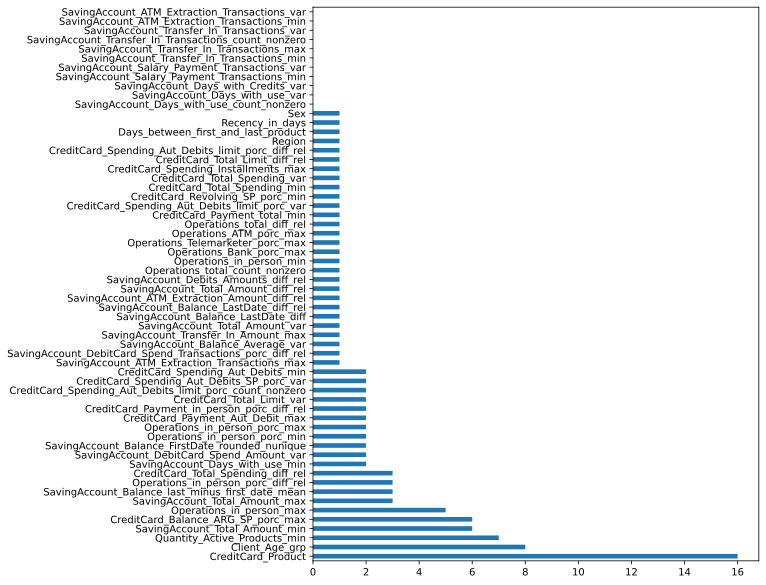

```python
variables_mas_importantes_0.head(100)
```

```python
plot_top_features(variables_mas_importantes_1, "most_important_variables_1", 40)
```

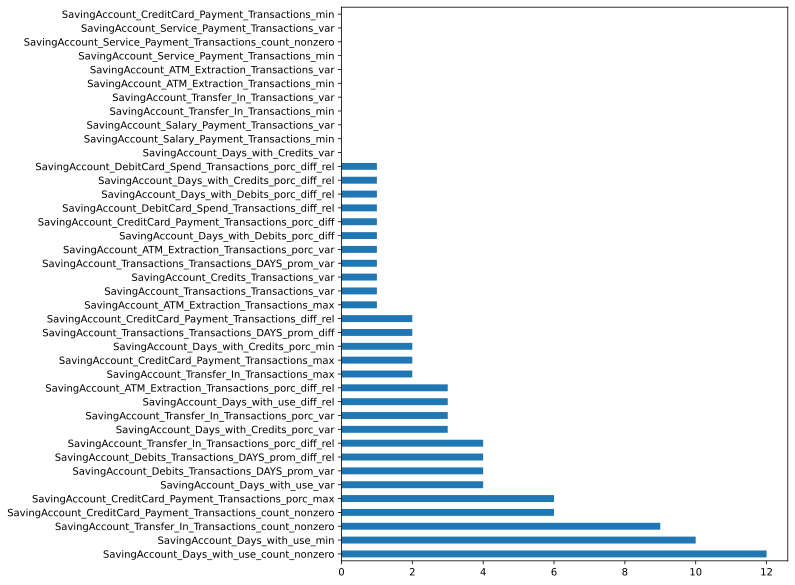

```python
variables_mas_importantes_1.head(20)
```

```python
plot_top_features(variables_mas_importantes_2, "most_important_variables_2", 60)
```

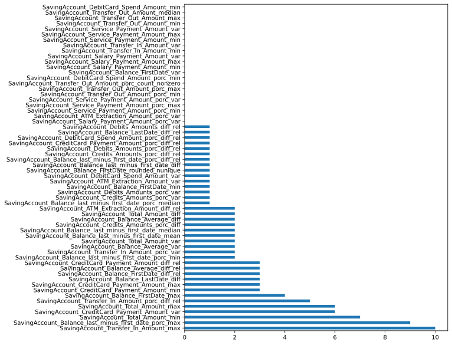

```python
variables_mas_importantes_2.head(20)
```

```python
plot_top_features(variables_mas_importantes_3, "most_important_variables_3", 40)
```

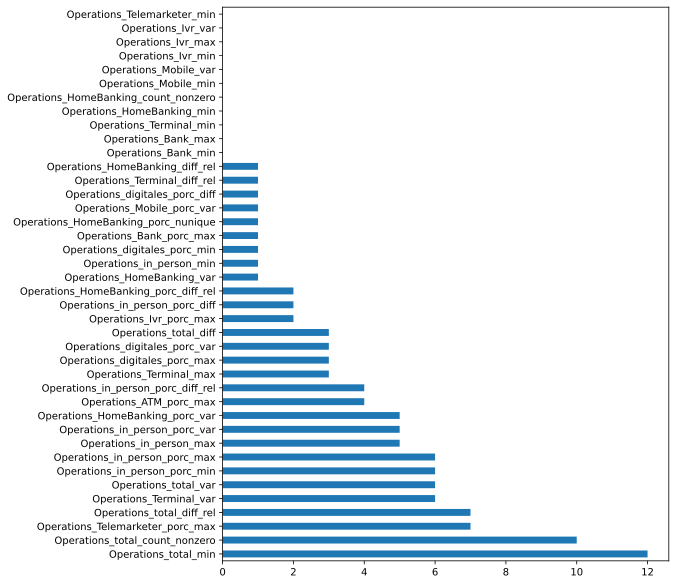

```python
variables_mas_importantes_3.head(20)
```

```python
plot_top_features(variables_mas_importantes_4, "most_important_variables_4", 25)
```

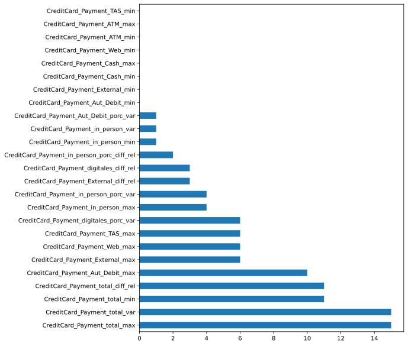

```python
variables_mas_importantes_4.head(20)
```

```python
plot_top_features(variables_mas_importantes_5, "most_important_variables_5", 60)
```

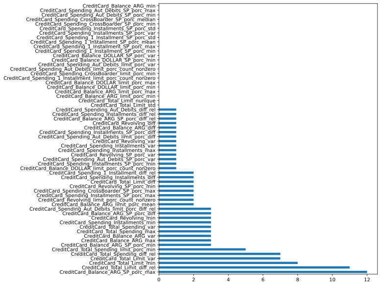

```python
variables_mas_importantes_5.head(20)
```

```python
plot_top_features(variables_mas_importantes_6, "most_important_variables_6", 40)
```

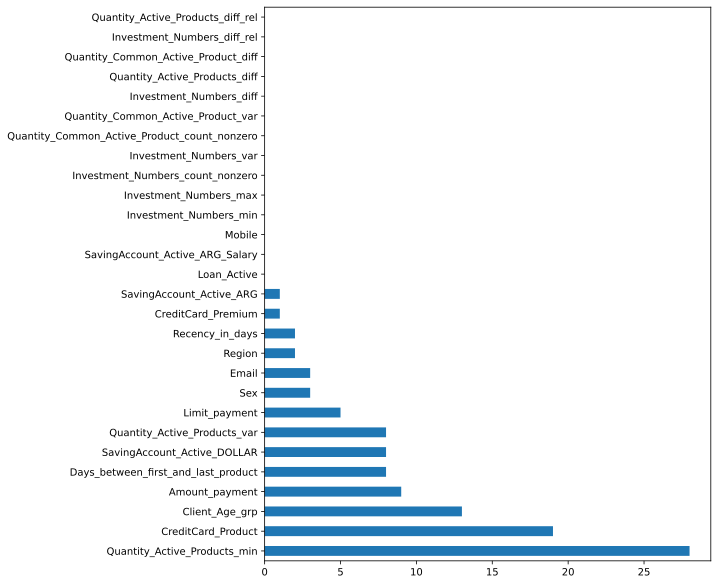

```python
variables_mas_importantes_6.head(20)
```

# Analisis Bivariado

```python
columnas_a_graficar = [
    "SavingAccount_Days_with_use_count_nonzero",
    "SavingAccount_Transfer_In_Transactions_count_nonzero",
    "SavingAccount_Transfer_In_Transactions_max",
    "SavingAccount_Days_with_use_min",
    "SavingAccount_Days_with_Credits_porc_var",
    "SavingAccount_CreditCard_Payment_Transactions_max",
    "SavingAccount_CreditCard_Payment_Transactions_count_nonzero",

    "SavingAccount_Balance_FirstDate_max",
    "SavingAccount_CreditCard_Payment_Amount_max",
    "SavingAccount_Transfer_In_Amount_max",
    "SavingAccount_Total_Amount_min",
    "SavingAccount_Total_Amount_diff",
    "SavingAccount_Balance_LastDate_diff_rel",

    "Operations_total_count_nonzero",
    "Operations_total_min",
    "Operations_total_var",
    "Operations_Telemarketer_porc_max",
    "Operations_in_person_porc_min",
    "Operations_in_person_porc_max",

    "CreditCard_Payment_total_max",
    "CreditCard_Payment_Aut_Debit_max",
    "CreditCard_Payment_total_min",
    "CreditCard_Payment_TAS_max",
    "CreditCard_Payment_Cash_max",
    "CreditCard_Payment_Web_max",
    "CreditCard_Payment_Aut_Debit_min",
    "CreditCard_Payment_Aut_Debit_diff",
    "CreditCard_Payment_ATM_max",
    "CreditCard_Payment_in_person_porc_diff_rel",

    "CreditCard_Payment_in_person_max",

    "CreditCard_Total_Limit_var",
    "CreditCard_Total_Limit_diff_rel",
    "CreditCard_Balance_ARG_SP_porc_max",
    "CreditCard_Total_Limit_min",
    "CreditCard_Revolving_min",
    "CreditCard_Total_Spending_diff_rel",
    "CreditCard_Spending_Aut_Debits_diff_rel",

    "CreditCard_Product",
    "Recency_in_days",
    "Days_between_first_and_last_product",
    "Client_Age_grp",
    "Quantity_Active_Products_min",
    "Quantity_Active_Products_nunique",
    "SavingAccount_Active_ARG_Salary",
    "Sex",
    "SavingAccount_Active_DOLLAR",
    "Region",
    "Quantity_Active_Products_var",
    "Investment_Numbers_max",
    "Email",

    "Quantity_Common_Active_Product_count_nonzero",
]

generate_bivariate_charts(
    ABT_reducida, # dataset con variables sin standarizar
    columnas_a_graficar,
    "analysis"
)
```


```python
graf = [
    "CreditCard_Payment_total_var",

    "Limit_operations",

    "SavingAccount_CreditCard_Payment_Amount_max",
    "CreditCard_Total_Limit_diff_rel",

    "SavingAccount_Days_with_use_count_nonzero",
    "SavingAccount_Days_with_use_min",
    "SavingAccount_CreditCard_Payment_Transactions_count_nonzero",

    "Operations_total_count_nonzero",
    "Operations_in_person_porc_max",

    "CreditCard_Payment_total_max",
    "CreditCard_Payment_Aut_Debit_max",
    "CreditCard_Payment_in_person_max",

    "CreditCard_Product",
    "Days_between_first_and_last_product",
    "Client_Age_grp",
    "Quantity_Active_Products_min",
    "Recency_in_days",
]

generate_bivariate_charts(
    ABT, # dataset con variables sin standarizar
    graf,
    "analysis_2"
)
```


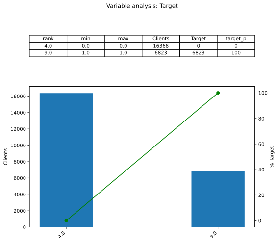


## Re-entreno con las mejores variables

```python
prueba = [
    "SavingAccount_Days_with_use_count_nonzero",
    "SavingAccount_Transfer_In_Transactions_count_nonzero",
    "SavingAccount_Transfer_In_Transactions_max",
    "SavingAccount_Days_with_use_min",
    "SavingAccount_Days_with_Credits_porc_var",
    "SavingAccount_CreditCard_Payment_Transactions_max",
    "SavingAccount_CreditCard_Payment_Transactions_count_nonzero",

    "Operations_total_count_nonzero",
    "Operations_total_min",
    "Operations_total_var",
    "Operations_Telemarketer_porc_max",
    "Operations_in_person_porc_min",
    "Operations_in_person_porc_max",

    "CreditCard_Payment_total_var",
    "CreditCard_Payment_total_max",
    "CreditCard_Payment_Aut_Debit_max",
    "CreditCard_Payment_total_min",
    "CreditCard_Payment_TAS_max",
    "CreditCard_Payment_Cash_max",
    "CreditCard_Payment_Web_max",
    "CreditCard_Payment_Aut_Debit_min",
    "CreditCard_Payment_Aut_Debit_diff",
    "CreditCard_Payment_ATM_max",
    "CreditCard_Payment_in_person_porc_diff_rel",

    "CreditCard_Payment_in_person_max"
]

searcher_7, variables_mas_importantes_7 = get_feature_importances(
    X_train, prueba
)
print_roc(searcher_7)
searcher_7
```

```python
plot_top_features(variables_mas_importantes_7, "most_important_variables_7", 25)
```


```python
variables_mas_importantes_7.head(25)
```

## Re-entreno con las mejores variables

```python
prueba_2 = [
    "SavingAccount_Days_with_use_count_nonzero",
    "SavingAccount_Days_with_use_min",
    "SavingAccount_CreditCard_Payment_Transactions_count_nonzero",

    "SavingAccount_CreditCard_Payment_Amount_max",

    "Operations_total_count_nonzero",
    "Operations_in_person_porc_max",

    "CreditCard_Payment_total_max",
    "CreditCard_Payment_Aut_Debit_max",
    "CreditCard_Payment_in_person_max",

    "CreditCard_Total_Limit_diff_rel",

    "CreditCard_Product",
    "Days_between_first_and_last_product",
    "Client_Age_grp",
    "Quantity_Active_Products_min",
]

searcher_8, variables_mas_importantes_8 = get_feature_importances(
    X_train, prueba_2
)
print_roc(searcher_8)
searcher_8
```

```python
plot_top_features(variables_mas_importantes_8, "most_important_variables_8", 25)
```


```python
variables_mas_importantes_8.head(25)
```

## Buscando variables correlacionadas eliminadas anteriormente

```python
# si estan correlacionadas se pueden intercambiar sin problemas
# la idea es agarrar variables faciles de explicar a gente no tecnica

for x in [
    "SavingAccount_CreditCard_Payment_Amount_max",
    "Operations_total_count_nonzero",
    "CreditCard_Total_Limit_diff_rel",
    # "CreditCard_Product",
    "Days_between_first_and_last_product",
    "Client_Age_grp",
    "Quantity_Active_Products_min",
]:
    idx = cols.index(x)
    vals = triangulo_superior[idx]
    correlated = [cols[i] for i in range(len(cols)) if (vals[i] > 0.50) and (i != idx)]
    print("Columnas correlacionadas con", x, ":")
    print(correlated)
    print("\n")
```

## Re-entreno con las mejores variables

```python
prueba_3 = [
    # "SavingAccount_CreditCard_Payment_Amount_max",
    # "CreditCard_Total_Limit_diff_rel",
    # "Days_between_first_and_last_product",
    # "Quantity_Active_Products_min"
    "Operations_total_count_nonzero",
    "CreditCard_Product",
    "Client_Age_grp",
]

searcher_9, variables_mas_importantes_9 = get_feature_importances(X_train, prueba_3)
print_roc(searcher_9)
searcher_9
```

```python
plot_top_features(variables_mas_importantes_9, "most_important_variables_9", 25)
```

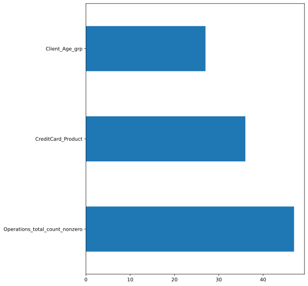

```python
variables_mas_importantes_9.head(25)
```

# Transformando mejores variables segun analisis bivariado y LightGBM

```python
ABT_reducida_3 = ABT_reducida.clone()
```

```python
# transformo variables agregando porcentaje de target a cada variable y agrupo valores.
# y agrupo variables categoricas (ya las transforme anteriormente)
# hice los calculos en un excel

# CreditCard_Product
# junto los tipos de tarjetas de bajo porcentaje de target y
# los tipos de tarjetas poco representativas en un solo bin
ABT_reducida_3 = ABT_reducida_3.with_columns(
    binning_by_ranges(
        "CreditCard_Product",
        ranges=[
            (36.890, 36.950),
            (45.680, 45.690),
        ],  # tipo tarjeta 202 y 104 respectivamente
        values=[36.940, 45.686],
        default=9.005,
    ).alias("CreditCard_Product_t")
)
# default -> agrupo totas las demas tarjetas (sin tarjeta de credito + 102 + 123 + 124 + 702 + 1002)
print(ABT_reducida_3["CreditCard_Product_t"].value_counts())
print("\n")

# Client_Age_grp
ABT_reducida_3 = ABT_reducida_3.with_columns(
    binning_by_ranges(
        "Client_Age_grp",
        # agrupo "Entre 50 y 59 años" + "Entre 60 y 64 años" +
        # "Entre 65 y 69 años" (final: "Entre 50 y 69 años")
        ranges=[(34.880, 39.772)],
        values=[36.224],
        default=25.093,
    ).alias("Client_Age_grp_t")
)
# default -> totas las demas edades
# ("Entre 18 y 29 años" + "Entre 30 y 39 años" + "Entre 40 y 49 años" + "Mayor a 70 años")
print(ABT_reducida_3["Client_Age_grp_t"].value_counts())
print("\n")

# Operations_total_count_nonzero
ABT_reducida_3 = ABT_reducida_3.with_columns(
    binning_by_ranges(
        "Operations_total_count_nonzero",
        ranges=[(0, 0), (1, 3), (4, 5)],
        values=[10.148, 18.896, 29.131],
        default=47.939,
    ).alias("Operations_total_count_nonzero_t")
)
print(ABT_reducida_3["Operations_total_count_nonzero_t"].value_counts())
print("\n")


# # Region
# ABT_reducida_3 = ABT_reducida_3.with_columns(binning_by_ranges(
#     'Region',
#     ranges=[(24.370, 24.375)],  # mantengo "REGION CENTRO"
#     values=[24.372],
#     default=30.663,
# ).alias("Region_t"))
# # default -> totas las demas regiones
# # (NORTE GRANDE ARGENTINO + CUYO + CABA Centro/Norte + AMBA Resto + BUENOS AIRES
# # + REGION PATAGONICA)
# print(ABT_reducida_3['Region_t'].value_counts())
# print("\n")

# # Intento de agrupar demas variables (comentado, calculado en excel)
# # Quantity_Active_Products_min
# ABT_reducida_3 = ABT_reducida_3.with_columns(binning_by_ranges(
#     'Quantity_Active_Products_min',
#     ranges=[(0, 3), (5, 8)],
#     values=[17.664, 61.729],
#     default=40.000,
# ).alias("Quantity_Active_Products_min_t"))
# print(ABT_reducida_3['Quantity_Active_Products_min_t'].value_counts())
# print("\n")

# # Operations_in_person_max
# ABT_reducida_3 = ABT_reducida_3.with_columns(binning_by_ranges(
#     'Operations_in_person_max',
#     ranges=[(1, 2), (3, 44)],
#     values=[36.971, 54.786],
#     default=17.000,
# ).alias("Operations_in_person_max_t"))
# print(ABT_reducida_3['Operations_in_person_max_t'].value_counts())
# print("\n")

# # Days_between_first_and_last_product
# ABT_reducida_3 = ABT_reducida_3.with_columns(binning_by_ranges(
#     'Days_between_first_and_last_product',
#     ranges=[(0, 441), (442, 1142), (1143, 2130)],
#     values=[21.764, 25.244, 33.003],
#     default=48.858,
# ).alias("Days_between_first_and_last_product_t"))
# print(ABT_reducida_3['Days_between_first_and_last_product_t'].value_counts())
# print("\n")

# # Recencia_en_dias
# ABT_reducida_3 = ABT_reducida_3.with_columns(binning_by_ranges(
#     'Recency_in_days',
#     ranges=[(1, 408), (409, 650)],
#     values=[33.822, 29.220],
#     default=23.845,
# ).alias("Recency_in_days_t"))
# print(ABT_reducida_3['Recency_in_days_t'].value_counts())
# print("\n")

# # CreditCard_Total_Spending_median
# ABT_reducida_3 = ABT_reducida_3.with_columns(binning_by_ranges(
#     'CreditCard_Total_Spending_median',
#     ranges=[(0.5, 1979.9), (1980.2, 4078.7), (4079.0, 117452)],
#     values=[33.866, 41.667, 46.154],
#     default=9.000,
# ).alias("CreditCard_Total_Spending_median_t"))
# print(ABT_reducida_3['CreditCard_Total_Spending_median_t'].value_counts())
# print("\n")

# # SavingAccount_Balance_Average_median
# ABT_reducida_3 = ABT_reducida_3.with_columns(binning_by_ranges(
#     'SavingAccount_Balance_Average_median',
#     ranges=[(163.3, 2823.9), (2824.0, 1515662.7)],
#     values=[30.999, 50.143],
#     default=22.243,
# ).alias("SavingAccount_Balance_Average_median_t"))
# print(ABT_reducida_3['SavingAccount_Balance_Average_median_t'].value_counts())
# print("\n")

# # SavingAccount_Transactions_Transactions_median
# ABT_reducida_3 = ABT_reducida_3.with_columns(binning_by_ranges(
#     'SavingAccount_Transactions_Transactions_median',
#     ranges=[(0, 3), (3.5, 7)],
#     values=[21.781, 31.686],
#     default=54.346,
# ).alias("SavingAccount_Transactions_Transactions_median_t"))
# print(ABT_reducida_3['SavingAccount_Transactions_Transactions_median_t'].value_counts())
# print("\n")

# # SavingAccount_CreditCard_Payment_Amount_median
# ABT_reducida_3 = ABT_reducida_3.with_columns(binning_by_ranges(
#     'SavingAccount_CreditCard_Payment_Amount_median',
#     ranges=[(0, 0)],
#     values=[21.000],
#     default=55.253,
# ).alias("SavingAccount_CreditCard_Payment_Amount_median_t"))
# print(ABT_reducida_3['SavingAccount_CreditCard_Payment_Amount_median_t'].value_counts())
# print("\n")
```

```python
mejores_variables = [
    "CreditCard_Product_t",
    "Client_Age_grp_t",
    "Operations_total_count_nonzero_t",
]

generate_bivariate_charts(
    ABT_reducida_3,  # dataset con variables sin standarizar
    mejores_variables,
    "analysis_t",
)
```


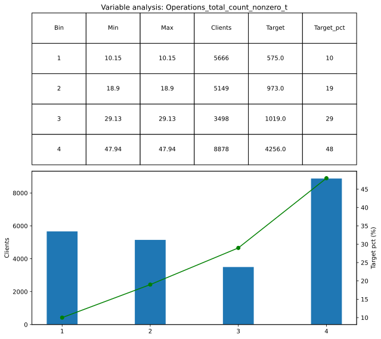


```python
scan_anomalies(ABT_reducida_3)
```

# Modelado


## Vuelvo a correr con las mejores variables y mejores hiperparametros

```python
# dataframe con variables transformadadas segun analisis bivariado
X_train_final, X_test_final = stratified_train_test_split(ABT_reducida_3)
```

```python
buscador_mejores_hiperparametros, variables_mas_importantes = get_feature_importances(
    X_train_final, mejores_variables, n_iter=20
)
print_roc(buscador_mejores_hiperparametros)
buscador_mejores_hiperparametros
```

```python
plot_top_features(variables_mas_importantes, "most_important_variables", 20)
```

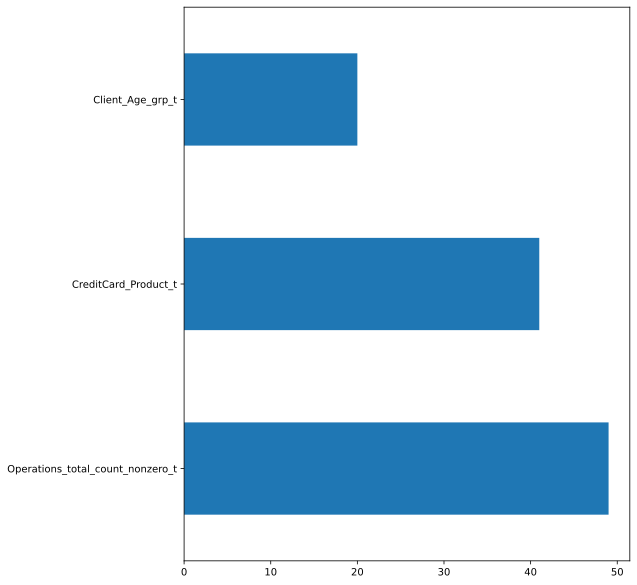


## Hiperparametros optimos

```python
buscador_mejores_hiperparametros.best_estimator_
```

```python
dic = {
    "CreditCard_Product_t": "Credit Card Type",
    "Client_Age_grp_t": "Between 50 and 69 years old",
    "Operations_total_count_nonzero_t": "Number of months with at least one operation",
}

variables_mas_importantes_renombradas = variables_mas_importantes.with_columns(
    pl.col(settings.col_feature)
    .replace_strict(dic, default=pl.col(settings.col_feature))
    .alias(settings.col_feature)
)

plot_top_features(variables_mas_importantes_renombradas, "Final")
```

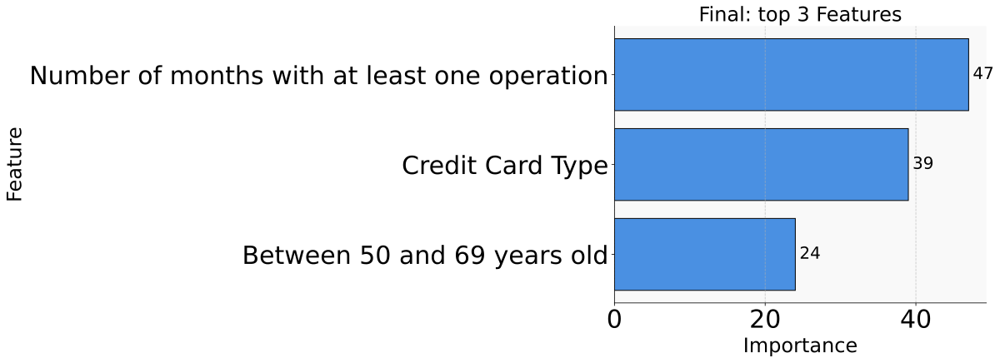


# Performance del modelo

```python
import lightgbm as lgb

modelo_LightGBM_clasificador_final: lgb.LGBMClassifier = (
    buscador_mejores_hiperparametros.best_estimator_
)

# Predice si es 0 o 1, si la probabilidad es > 0.5 lo pone como 1
y_pred = modelo_LightGBM_clasificador_final.predict(
    X_test_final.select(mejores_variables)
)

probabilities_train = modelo_LightGBM_clasificador_final.predict_proba(
    X_train_final.select(mejores_variables)
)
probabilities_test = modelo_LightGBM_clasificador_final.predict_proba(
    X_test_final.select(mejores_variables)
)
```

```python
print_train_deciles(compute_prediction_deciles(X_train_final, probabilities_train))
```

```python
# Cotas fijas....
# basado en los porcentajes de training
cotas = [
    0.035669,
    0.054470,
    0.204116,
    0.241664,
    0.269271,
    0.393079,
    0.443684,
    0.541165,
    0.548265,
]

test_deciles = compute_prediction_deciles(X_test_final, probabilities_test, cotas)

print_test_deciles(test_deciles, X_test_final, probabilities_test)
```

# ROC

```python
plot_roc_and_metrics(
    X_test_final[settings.col_target],
    probabilities_test,
    y_pred,
    graphic_name="lightgbm",
)
```


# Resultados del excel


## Training


- ordena casi todos los deciles bien
- deciles masomenos parejos
- lift del primer decil = 2,1
- KS = 43,1 en el 4to decil


## Testing


- ordena casi todos los deciles bien
- deciles masomenos parejos
- lift del primer decil = 2,1
- KS = 46,7 en el 4to decil 


## Diferencias 


- lift -> 0
- KS -> 3,6


# Verificando si el problema se puede resolver con una regresion logistica

```python
from sklearn.linear_model import LogisticRegression

modelo = LogisticRegression()
modelo.fit(X_train_final.select(mejores_variables), X_train_final[settings.col_target])

y_pred_log = modelo.predict(X_test_final.select(mejores_variables))
probabilities_train_log = modelo.predict_proba(X_train_final.select(mejores_variables))
probabilities_test_log = modelo.predict_proba(X_test_final.select(mejores_variables))
```

```python
print_train_deciles(compute_prediction_deciles(X_train_final, probabilities_train_log))
```

```python
# Cotas fijas....
# basado en los porcentajes de training
cotas = [
    0.051719,
    0.079377,
    0.170491,
    0.197105,
    0.267983,
    0.366586,
    0.467006,
    0.579763,
    0.580742,
]

test_deciles_log = compute_prediction_deciles(
    X_test_final, probabilities_test_log, cotas
)

print_test_deciles(test_deciles_log, X_test_final, probabilities_test_log)
```

```python
plot_roc_and_metrics(
    X_test_final[settings.col_target],
    probabilities_test_log,
    y_pred_log,
    graphic_name="logistic_regression",
)
```


```python

```
